# RootMe Writeup

> [!NOTE] [PT] Essa versão do writeup está em inglês. Clique [aqui](%28PT-BR%29%20RootMe%20Writeup.md) ou siga [este link (github)](https://github.com/Luke0133/offsec-ctf/blob/main/CTFs/RootMe/(PT-BR)%20RootMe%20Writeup.md) para ir para a versão em português.

> [!Warning] [EN] This writeup is unfinished. I'm still working to translate everything, sorry for the inconvenience

> Link to the CTF challenge: https://tryhackme.com/room/rrootme
## Sumário

> Github link for this writeup: https://github.com/Luke0133/offsec-ctf/blob/main/CTFs/RootMe/(EN%20-%20US)%20RootMe%20Writeup.md

- [Tools Used](#tools%20used)
- [RootMe Solving](#RootMe%20Solving)
	1. [Network Mapping](#Network%20Mapping)
	2. [Directory Enumeration](#Directory%20Enumeration)
	3. [Access as User](#Access%20as%20User%20(Reverse%20Shell))
	4. [Escalação de Privilégios](#Escalação%20de%20Privilégios)
- [Conclusão](#Conclusão)

## Tools Used

Para este CTF, foram utilizadas as seguintes ferramentas a seguir:
- [Nmap](https://nmap.org/): ferramenta de exploração da internet, criada para escanear rapidamente redes de larga escala. O Nmap realiza diversas requisições para um IP para determinar quais hosts estão disponíveis naquela rede, quais serviços que eles oferecem (por exemplo, HTTP, ssh, ...), quais sistemas operacionais (e versões destes) estão utilizando dentre outras informações. Sendo uma ferramenta poderosa para a enumeração de serviços e fornecimento de informações básicas sobre os hosts de uma rede, dados essenciais para alguém que está tentando invadir um sistema, o Nmap é muito utilizado em situações de pentesting e geralmente faz parte do primeiro passo nos CTFs.
- [Gobuster](https://github.com/OJ/gobuster): ferramenta responsável por enumerar por força bruta diretórios e arquivos, detectar subdomínios DNS e hosts virtuais, dentre outras funções. Por ser de alta performance, o Gobuster é essencial para agilizar o processo de encontrar diretórios de sistemas, poupando o desgaste da pessoa invasora de procurá-los manualmente, sendo, portanto recomendado para CTFs e pentesting.
- [Netcat](http://www.stearns.org/nc/): programa basico de Unix responsável por ler e escrever dados através de conexões de rede. Em um contexto de pentesting, o netcat é uma ótima ferramenta para criar conexões com os sistemas na rede e ter acesso a eles de forma remota, permitindo técnicas como a de reverse shell (explicada melhor [posteriormente](#Acesso%20como%20Usuário%20(Reverse%20Shell))), muito importante também nos contextos de CTF.

Bem como recursos como:
- [Reverse Shell Generator (revshells)](https://www.revshells.com/): site contendo códigos e comandos para gerar shells reversas de diversas maneiras, sendo então flexível para cada situação
- [GTFOBins](https://gtfobins.org/):  lista de executáveis estilo Unix que permitem ultrapassar restrições de segurança em sistemas vulneráveis, muito útil para realizar escalação de privilégio. Assim como o site anterior, contém um compilado de funções para várias situações.

Tendo organizado o sistema kali linux e checado as ferramentas acima, bem como acessado os recursos citados, é possível entrar no desafio em si presente na plataforma TryHackMe, o RootMe.

## Solução do RootMe

O CTF RootMe é uma introdução à segurança ofensiva, área da segurança computacional que se encarrega de encontrar vulnerabilidades em sistemas de forma legal para auxiliar no fortalecimento da segurança deles mesmos. Esse desafio foi dividido em 3 partes --"Reconnaissance", "Getting a shell" e "Privilege escalation" -- as etapas básicas para se realizar um CTF. 

Após conectar-me ao VPN do TryHackMe, obtive acesso à maquina e iniciei o desafio. A estratégia usada foi justamente a sugerida pela plataforma e pelo professor em sala de aula, sendo resumida nos passos abaixo:
1. [Enumeração de Rede](#Enumeração%20de%20Rede)
2. [Enumeração de Diretórios](#Enumeração%20de%20Diretórios)
3. [Acesso como Usuário](#Acesso%20como%20Usuário%20(Reverse%20Shell))
4. [Escalação de Privilégios](#Escalação%20de%20Privilégios)

### Network Enumeration

Iniciando a primeira etapa, usei o Nmap para identificar os serviços abertos na máquina alvo. Sendo o IP da máquina alvo `10.64.138.6`, o comando executado foi:

``` nmap -T4 10.64.138.6  ```

em que `-T4` representa o template de temporização (de 0 a 5, quanto maior, mais rápido, ou seja, mais interações e menos discrição). Como este é um contexto de CTF básico, não há necessidade de uma discrição na enumeração, por isso escolhi um número alto.

O resultado da enumeração está a seguir:

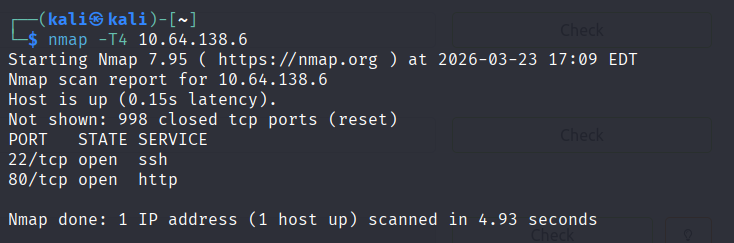

Com isso foi possível identificar que havia dois serviços abertos na máquina alvo: ssh e http. Antes de continuar, decidi responder a outras perguntas na ordem do roteiro do TryHackMe, sendo uma delas descobrir a versão do Apache que estava rodando. Para isso, bastou modificar o comando do Nmap para 

``` nmap -T4 10.64.138.6 -sV ```

em que o argumento `-sV` faz a busca determinar informações sobre a versão dos serviços em uso, resultando na imagem a seguir: 

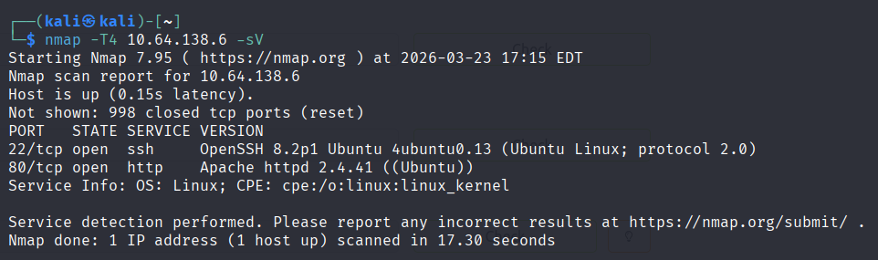

Diante dos novos resultados, verifiquei que o sistema estava na versão 2.4.41 do Apache. Mais uma vez, é possível perceber a utilidade do Nmap em rapidamente identificar informações sobre o sistema a ser atacado.

Sabendo que há apenas dois serviços sendo executados pela máquina, ssh e http, decidi me aprofundar no serviço http, dado que, geralmente, o ssh não é um alvo comum em CTFs e provavelmente estaria ali apenas para alguma autenticação de usuário como parte do serviço web que poderia ser utilizada para conectar-se à maquina alvo (no caso desse CTF não foi necessário interagir com o ssh).

Inserindo o IP da máquina no navegador, deparei-me com a seguinte página:

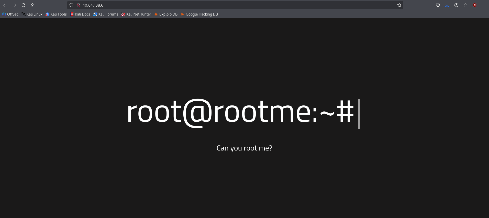

Diante da página inicial, decidi olhar o código fonte dela para ver se encontrava algo de interessante, mas não encontrei nenhuma informação relevante que pudesse me ajudar a invadir a máquina, mesmo encontrando os diretórios `/js` e `/css`, que, ao verificar, realmente apenas continham arquivos `.js` e `.css`, sem nada de interesse.

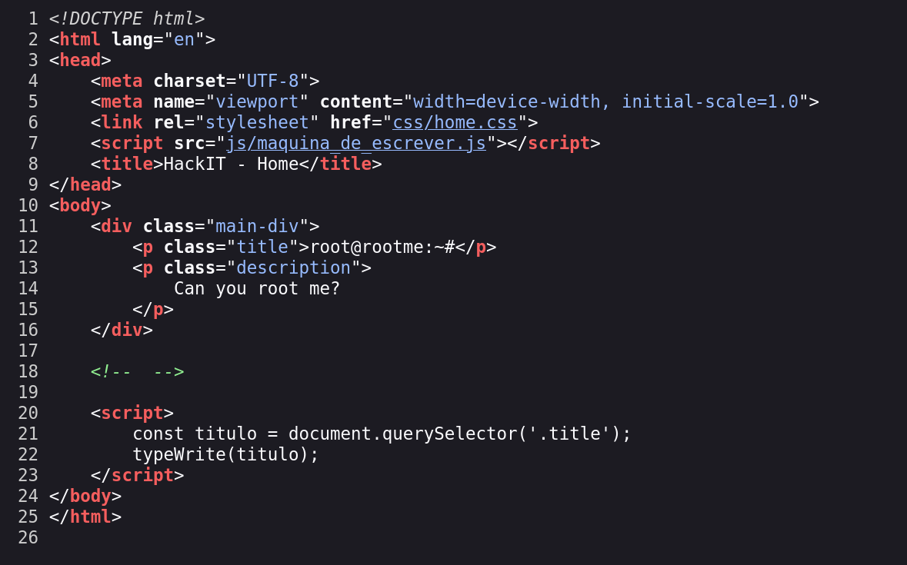

Todavia, para não gastar meu tempo à toa, antes de explorar sem rumo o sistema web, decidi executar logo o Gobuster enquanto verificava outros diretórios do site. 
### Directory Enumeration

Usando o Gobuster, foi possível enumerar os diretórios principais do sistema com facilidade. O comando que utilizei foi:

```gobuster dir -w /usr/share/wordlists/dirbuster/directory-list-2.3-medium.txt -u http://10.64.138.6 -x .php .html -t 50 ```

que essencialmente procura por diretórios (`dir`) usando uma wordlist fornecida contendo nomes comuns de diretórios (`-w`) em um url fornecido (`-u`), no caso, o da máquina alvo. Com o argumento `-x` expandi a busca para considerar extensões `.php` e `.html`, comuns em um sistema web, e com o argumento `-t 50` aumentei o número de threads para melhorar a eficiência, dado que a discrição não é um problema comum em CTFs. 

O resultado final foi o seguinte:

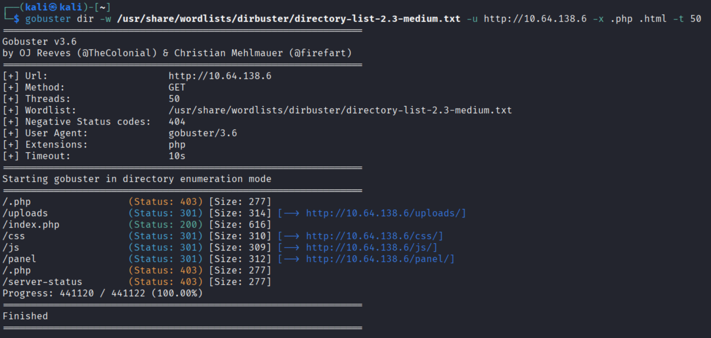

Todavia, como dito no final da seção anterior, continuei explorando o site enquanto executava o gobuster, ou seja, no momento em que este identificava um diretório novo, eu acessava a página desse diretório para tentar encontrar algo de interesse, dado que ele, apesar de ser mais rápido do que testar manualmente, continua sendo um algoritmo de força bruta e, mesmo escolhendo uma wordlist não tão grande (`directory-list-2.3-medium.txt`), pode ser demorado para testar todos os diretórios.

Em `/uploads` não encontrei nada de útil no momento, e já havia explorado `/css` e `/js` anteriormente, então quando descobri a existência de `/panel` entrei e me deparei com esta página:

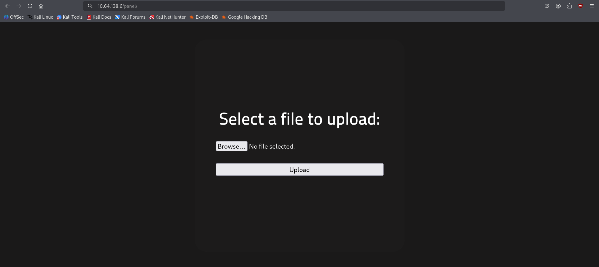

O diretório `/panel` continha um formulário para o upload de arquivos. Prontamente testei um arquivo básico `.html` para ver se o site realmente aceitava o upload de arquivos

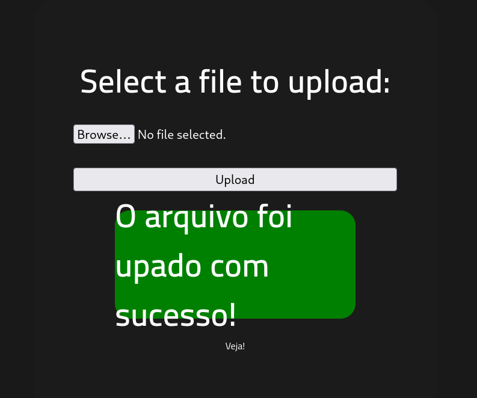

e ao clicar em ver, fui direcionado para a página de uploads, de forma mais específica, para o arquivo que eu havia enviado.

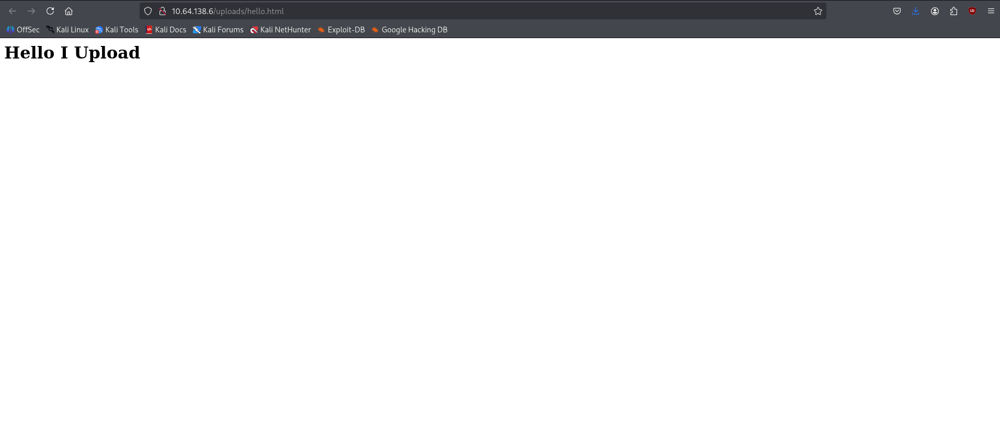

Sabendo que era possível enviar arquivos para o sistema e que, pelo gobuster, havia diretórios com a extensão `.php`, era hora de tentar obter acesso como usuário na máquina alvo.
### Access as User (Reverse Shell)

Com os conhecimentos obtidos na fase anterior, decidi criar uma reverse shell para ter um acesso remoto ao terminal do sistema. Essencialmente, uma shell reversa pode ser criada abrindo uma linha de comunicação por rede entre o computador e a máquina alvo, de forma que um terminal será aberto nela e todas as informações de entrada e saída serão comunicadas para o computador invasor, dando assim acesso ao usuário da máquina.

Para realizar isso, preparei no meu terminal um comando para escutar a porta `1234` com o netcat

``` netcat -lnvp 1234 ```

contendo os seguintes argumentos argumentos:
- `-l`: modo de escuta, justamente para receber as informações do terminal do outro sistema
-  `-n`: desativar o DNS, uma vez que já temos o IP direto, não é necessário ficar resolvendo nomes, deixando o netcat mais rápido
-  `-v`: modo verboso, para ter mais informações, no caso de problemas, por exemplo
-  `-p`: indica a porta de escuta, no caso `1234`

Após executar o comando, acessei o site [revshells.com](https://www.revshells.com/), que contém um compilado de códigos para gerar shells reversas e peguei o primeiro que achei para php (https://github.com/pentestmonkey/php-reverse-shell). 

Coloquei o IP da vpn do meu computador e a porta corretos e fiz o upload para o sistema:

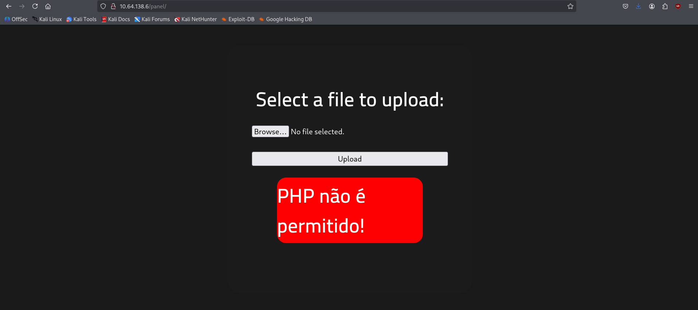

O site bloqueou o envio de um arquivo `.php`, porém pode ser que ele não rejeite outras versões de php, então, mudando para `.php5`, foi possível enviar o arquivo. 

Neste momento, o site ficou carregando eternamente, o que até seria esperado, dado que estaria executando um código para enviar e receber mensagens do seu terminal, ou seja, tem um loop de escuta e resposta. Todavia, a conexão com o netcat não foi estabelecida. Tentei executar novamente o comando do netcat, mas sem sucesso, e o site não respondia mais. Creio eu que, como o programa php foi executado antes de eu ter rodado o netcat. Infelizmente minha única opção foi resetar a máquina no TryHackMe.

Com a máquina reiniciada e com um IP novo, o upload foi bem sucedido e, ao clicar em "Veja", o site entrou no loop, como esperado e, dessa vez o netcat funcionou:

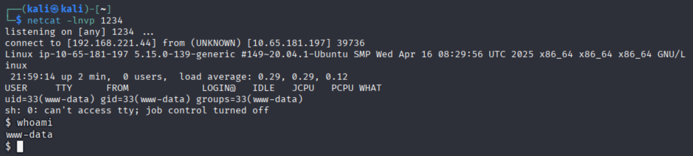

Tendo acesso direto ao terminal da máquina, testei para ver qual usuário eu era com `whoami` e descobri que era o www-data. Sabendo disso, a flag do `user.txt` provavelmente não deve estar no diretório `/home`, mas sim no diretório do usuário www-data, que seria `/var/www`, o local padrão para servidores webs baseados em Apache.

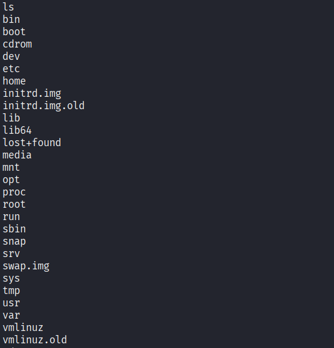

Essa ideia foi corroborada quando, executei:

```find / -iname 'user.txt' 2>/dev/null ```

O comando find procurou por um arquivo de nome `user.txt` desde o diretório raiz (`/`), ignorando os erros (`2>/dev/null`). Assim, ele retornou o lugar exato de `user.txt` e encontrei a primeira flag:

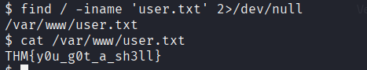

Após ter a primeira flag, o objetivo agora era realizar a escalação privilégio para obter a flag `root.txt`.
### Privilege Escalation

Por fim, para obter a flag em root, foi necessária a escalação de privilégios. Antes disso, porém, eu conferi se o meu usuário realmente não tinha acesso a comandos privilegiados com 

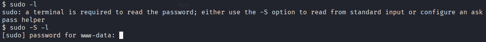

O comando `sudo -l` lista todos os comandos que podem ser usados como super user, mas em um contexto de reverse shell, necessitei de usar a flag `-S` para ler do input do meu terminal. Vendo que pediu uma senha, a qual eu não possuía, já suspeitei que o usuário www-data poderia ter algum privilégio, mesmo que não total. Para encontrar isso, executei

```find / -type f -perm -4000 2>/dev/null```

que busca por arquivos (`-type f`) que tenham a permissão de super user (`-perm -4000`) e ignora os erros, ou seja, mostra na tela apenas os arquivos que, em www-data, tem a permissão de executar comandos privilegiados. O resultado do processo mostrou vários arquivos, parte deles mostrados abaixo:

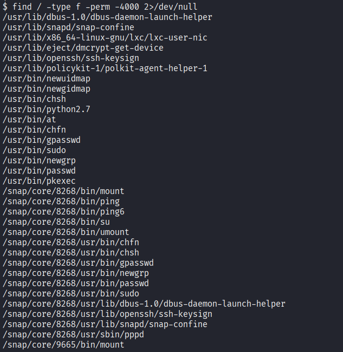

Ao ler a lista notei um arquivo interessante:

```/usr/bin/python2.7```

Isso é uma oportunidade para escalação de privilégios, pois é possível rodar comandos python com permissão de super user. Então, basta executar um programa em python que crie uma shell com privilégios elevados. Para isso, entrei no [GTFOBins](https://gtfobins.org/) e executei o comando em python correspondente:

```python -c 'import os; os.execl("/bin/sh", "sh", "-p")'```

Com isso, obtive acesso ao root, e naveguei até a pasta `/root`, na qual foi possível encontrar a flag `root.txt`, como visto abaixo:

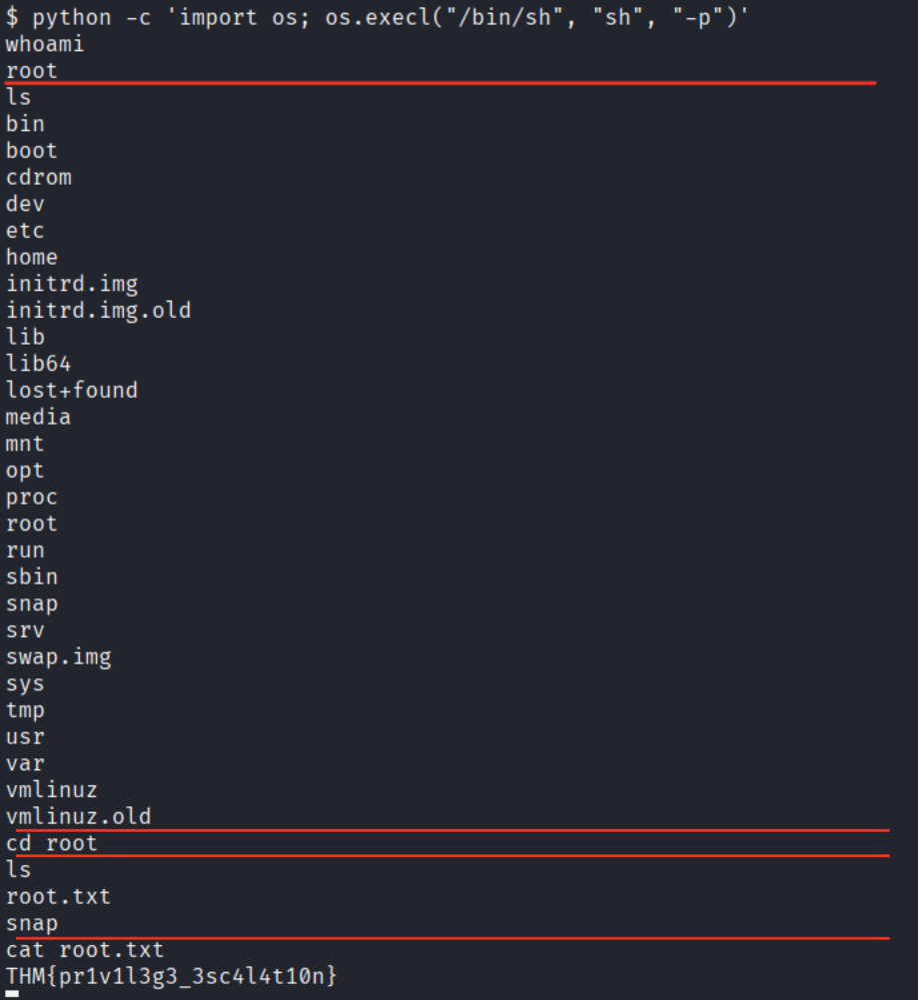

Tendo a última flag em mãos, concluí este CTF.
## Conclusão

Apesar de simples, o RootMe é um bom CTF para iniciantes, ensinando uma boa estratégia para invadir máquinas alvo. As ferramentas usadas foram essenciais para a rapidez do processo, bem como os recursos utilizados agilizaram os processos de shell reversa e escalação de privilégios. A minha maior dificuldade foi na hora de criar a shell reversa, em que inverti a ordem de execução entre o netcat e o programa php enviado, o que me impossibilitou de continuar (não sei se teria um jeito de resolver sem resetar a máquina). Fora isso, foi um bom desafio para me adentrar mais no mundo de segurança ofensiva. 